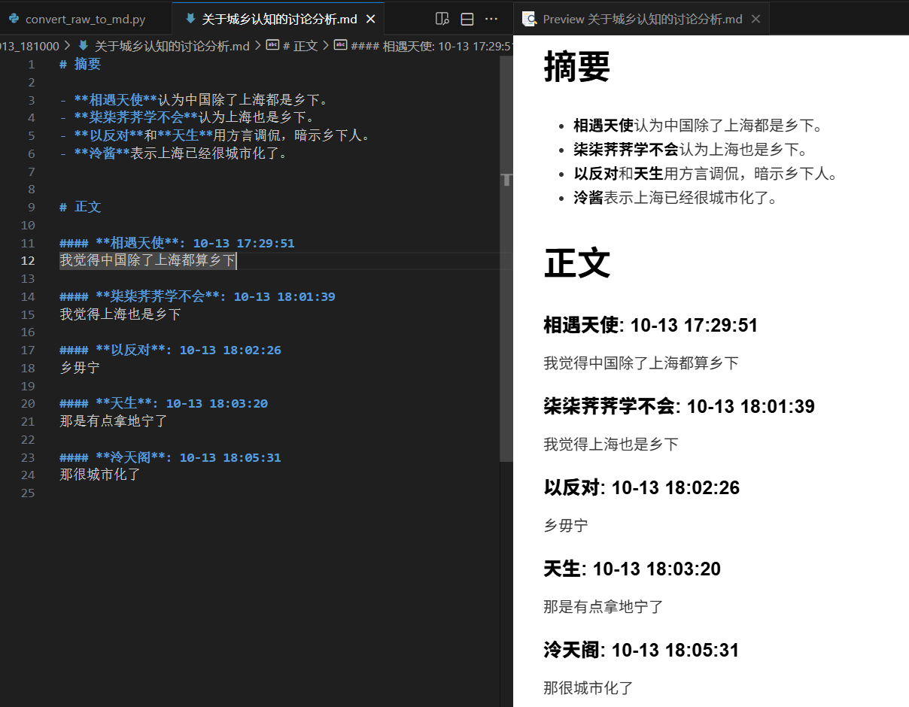

# 摘要

**主要事件**：
- 泠酱完成了一个半自动QQ聊天记录整理脚本，通过复制聊天记录到剪贴板后，脚本自动处理内容。

**讨论要点**：
1. **半自动原因**：
   - 避免开发QQ插件（存在安全风险、更新维护负担）。
   - 依赖QQ内置复制功能，降低开发复杂度。
2. **局限性**：
   - 当前脚本仅适配泠酱的本地环境，未做通用化处理。
3. **对比方案**：
   - 提及腾讯元宝的聊天记录总结功能，但泠酱指出其脚本已集成DeepSeek API进行本地化自动总结归档。

**结论**：  
泠酱选择半自动化方案以平衡效率与风险，优先通过剪贴板交互实现聊天记录的本地处理与智能总结。

# 正文

#### **泠天阁**: 10-13 18:10:51
好！ 写了一下午

终于做完半自动的QQ聊天记录笔记整理脚本了

有没有懂的（）

#### **相遇天使**: 10-13 18:11:27
这么厉害

那我能不能给我的QQ接入nonebot

#### **洛水天依**: 10-13 18:11:46
如何半自动

#### **相遇天使**: 10-13 18:11:46

#### **洛水天依**: 10-13 18:11:53
把聊天记录复制过去

#### **泠天阁**: 10-13 18:12:05
多选聊天记录复制到剪贴板就行

然后脚本会自动读取剪贴板内容进行处理

#### **相遇天使**: 10-13 18:12:39
为什么不能全自动检测全内容

#### **洛水天依**: 10-13 18:12:41
感觉不如

#### **泠天阁**: 10-13 18:12:41
不过目前仅限于我这台电脑 因为好多地方我都没做通用处理

#### **洛水天依**: 10-13 18:12:47
腾讯元宝

#### **云上楼阁**: 10-13 18:12:49
重大科研成果

#### **泠天阁**: 10-13 18:12:53
因为做QQ插件有风险

#### **云上楼阁**: 10-13 18:13:02
必须上报马慧

#### **泠天阁**: 10-13 18:13:10
一方面来说这玩意得写很多前端交互 而且还有可能被腾讯检测出来警告（）

另外一方面QQ更新了我也得更新

不如直接借用QQ内置功能

腾讯这个AI平台还有这样的功能吗

#### **洛水天依**: 10-13 18:18:23
有聊天记录总结

#### **泠天阁**: 10-13 18:18:55
那可以自动帮我归档到本地吗

我现在是用的deepseek的API做的总结
