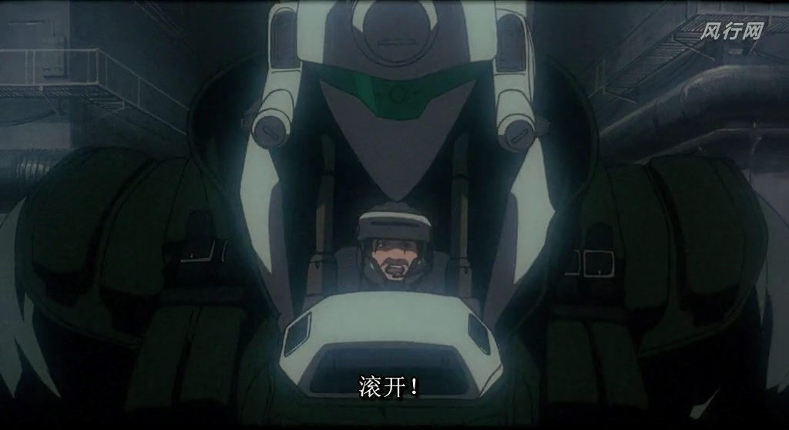
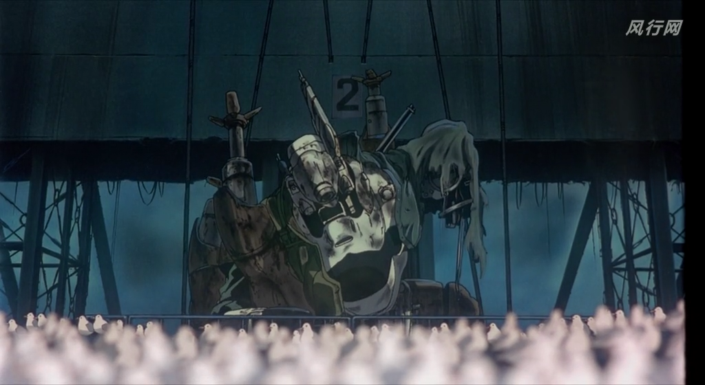

# 摘要

泠酱对比了《机动警察剧场版2》和《86》中的两个相似场景，指出了两者在表现手法上的差异和优劣。

**主要观点：**
- **战损描写**：《机动警察》通过电梯缓慢上升的长镜头，有序展示了机体战损细节，营造了强烈的"战斗之后"氛围；而《86》虽然通过人物特写和战友牺牲来表现战斗惨烈，却缺少对座驾战损的具体描写，使得战斗实感不足。
- **场景设计**：两者都使用了大量地面道具（海鸥/无人机）来烘托场景，但《机动警察》的海鸥设计更自然合理 - 海岛环境本就有海鸥聚集，被惊飞的行为符合常理；而《86》的无人机铺满战场、恰好遮盖曼珠沙华的设计显得刻意做作，无人机躺尸后突然飞走的行为也缺乏逻辑。

**结论：**
泠酱认为《机动警察》在战损细节展示和场景自然度方面都优于《86》，押井守对海鸥的运用比《86》的无人机设计更加高明和协调。

# 正文

#### **泠天阁**: 09-03 15:45:09
泠酱在比较机动警察剧场版2和86之前，先把片源链接发出来

86的这个场景可以参见屑站视频 https://www.bilibili.com/video/BV1NS4y1273K/

[文件]

机动警察的场景参见↑

#### **泠天阁**: 09-03 16:01:21
我们首先来比较的地方是对于双方座驾的描写

在机动警察中，作战计划的倒数第二步是乘电梯到达地面，最后再对犯人进行逮捕。但是出人意料的是电梯里面居然还有一台敌机拦路，于是南云驾驶着机动警察向其展开决死的突击

然而这里却有意跳过了战斗的过程，而是在下一个镜头直接切到了地表

从电梯设施的远景到上方俯视电梯井的近景这两个镜头预示着战斗的结果将从被上行的电梯揭晓

最后一个长静止镜头，机动警察缓缓上升到画面中心，而后舱门爆破开惊起大群海鸥

泠酱非常喜欢的一点在于，这个主体缓慢上升的中景给了观众充分的时间观察这台战损版的机动警察

#### **泠天阁**: 09-03 16:13:11
同时，通过电梯从画面之外缓缓升出的设计，也给予了良好的视线引导，即使是完全没有任何变化的静止镜头，观众也可以有序地依次观察受损的各个部位

相反的 86的这个场景中就没有对战损版破坏神的描写

几乎全部都是人物特写和远景

虽然我们知道 86这里更加重要的是人物情感的进一步接触 因此给予更多的人物特写并无不可

#### **泠天阁**: 09-03 16:24:09
但是在更长的篇幅中却没有加入受损战车的描写，泠酱是觉得有点缺憾的，这样“战斗之后”的感觉就略显不足了

86的制作组当然是知道要告诉观众这一点的，所以一方面辛变成了战损版，另外一方面也通过一个镜头告诉大伙战友都莫得了

但是在涉及到辛的座驾时，无论是内饰还是外观，我们都找不到战损的明显表现（尽管这台机体已经站不起来了，想必是受了相当程度的损伤）

这一点上来说，泠酱觉得有些可惜

#### **泠天阁**: 09-03 16:34:59
然后是第二点，两个场景还有非常相似的设计，即地面上的大量演出道具（电磁干扰无人机 or 海鸥）

虽然二者的用法确有不同，但是南云入场惊飞海鸥与蕾娜入场惊飞无人机的设计让泠酱看到这里有了高度的似曾相识感（）

之前泠酱已经从多个角度尝试论证过，这个“无人机地毯下面再放一层曼珠沙华地毯”的设计是过于浮夸的奇观

[聊天记录]

相比之下，泠酱觉得机动警察这里的设计在与场景的融洽度上就高得多

#### **泠天阁**: 09-03 16:45:49
因为首先，虽然二者都存在着一定程度的夸张，但在海岛上有大片海鸥聚集的情况是自然的，而战场上有且仅有此处存在大片被无人机恰好遮住的曼珠沙华是不自然的

其次，海鸥被惊飞的行为当然是自然的，但无人机先前在地上躺尸摆烂，等蕾娜来了又飞走的行为是令人费解的

泠酱觉得，押子对于海鸥的用法，比86这里要高明的多
