# 摘要

**主要观点**
- 观众对动画第二集的评价褒贬不一，普遍认为正片内容平淡，不如OP/ED吸引人
- 第二集因删减"神人"情节导致观众兴趣下降，进入"贤者时间"
- 相比第一集的"摆摊式"后宫介绍，第二集减少了明显的近景特写，但聊天剧情仍使整体景别偏近，给人"全是大脸"的感觉
- 动态处理方式与《天国大魔境》有相似之处

**涉及作品**
**《天国大魔境》**

# 正文

### **泠天阁**: 10-15 01:26:28
社区观察：

嗜血乐子人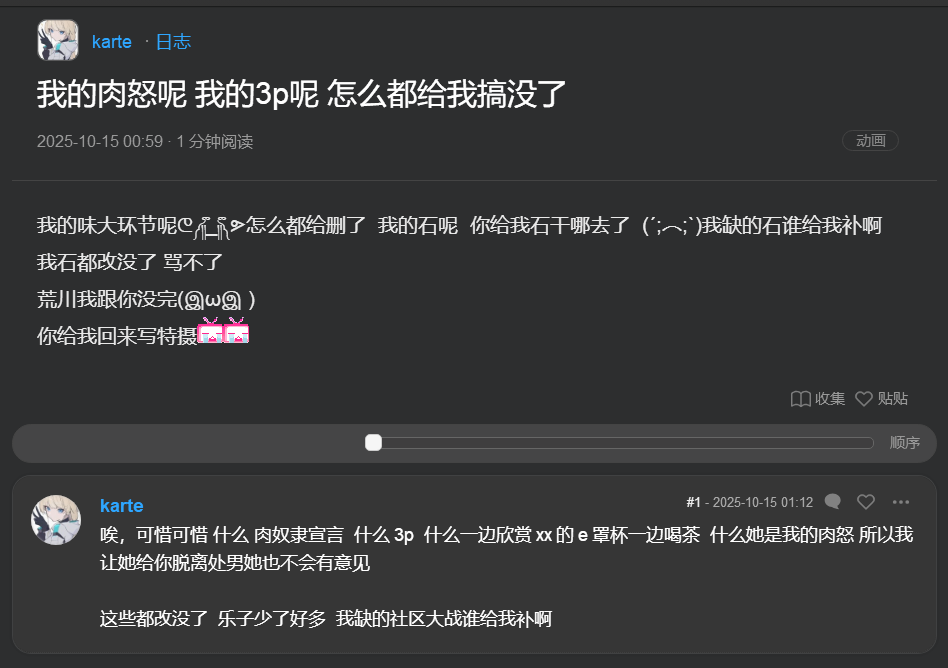

反对说教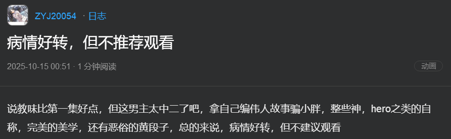

OPED全靠外援 正片确实平淡无味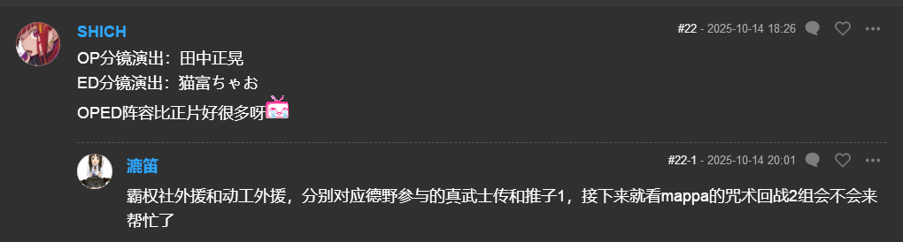

woc别说，还真是跑步像天国大魔境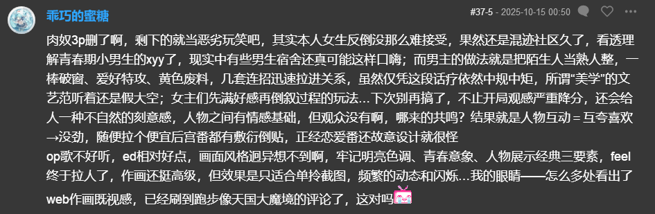

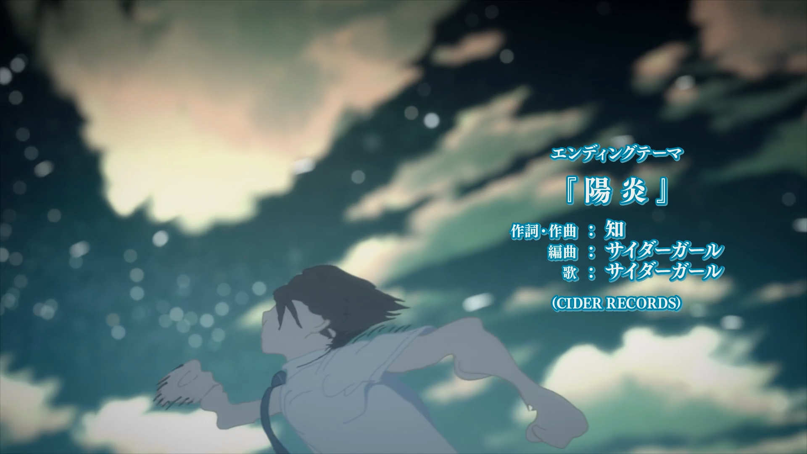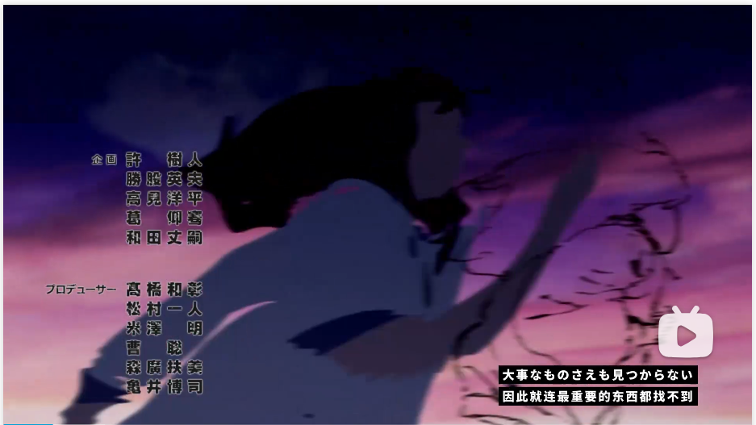

重新对比了一下天国大魔境OP和千岁同学ED 感觉倒也没那么像

不过对于动态的处理确实有相似之处

### **泠天阁**: 10-15 01:36:55
最作豚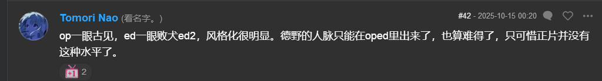

依旧有一些继续反对千岁朔做法的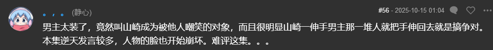

相对的，正面的解读也有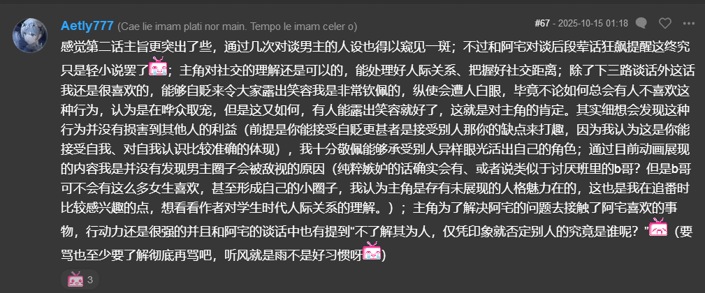

由于第二集没那么多抽象演出和情节，观众主要都关注被删减的神人内容了（）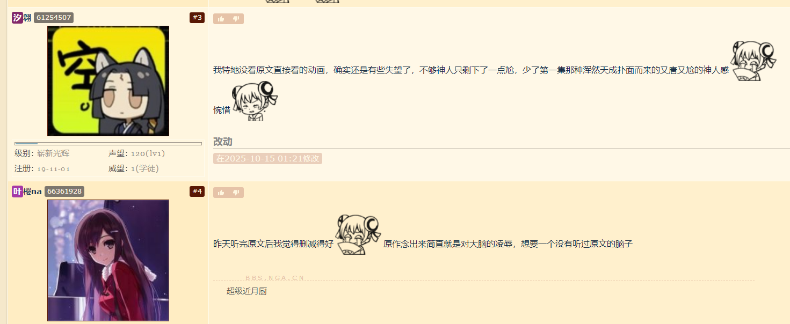

总的来说感觉大部分观众都因为没有神人情节而进入贤者时间了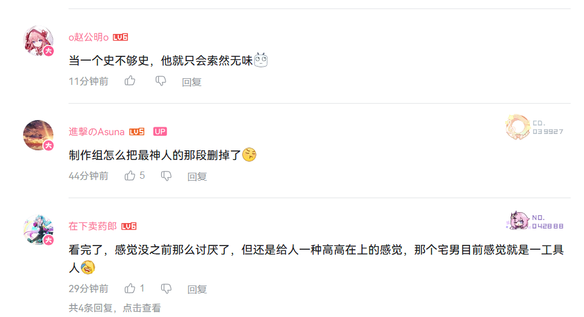

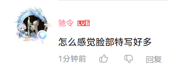相比于为了介绍五位后宫而直接搞摆摊式演出的第一集，第二集确实感觉那种意味特别明显的近景特写少了

但是由于全是聊天剧情，整体景别还是比较近 确实依旧给人以全是大脸的感觉

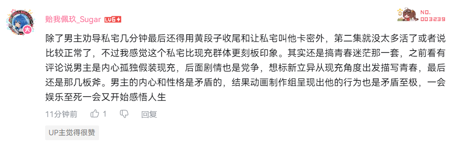
