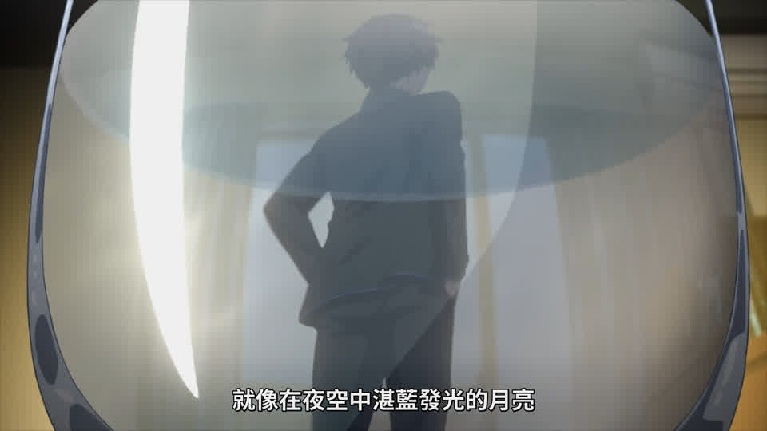
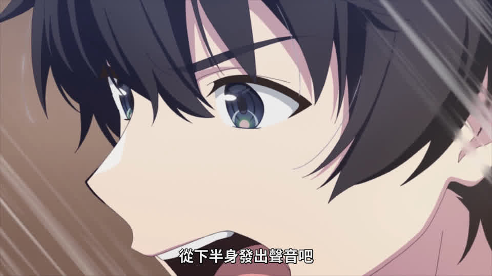
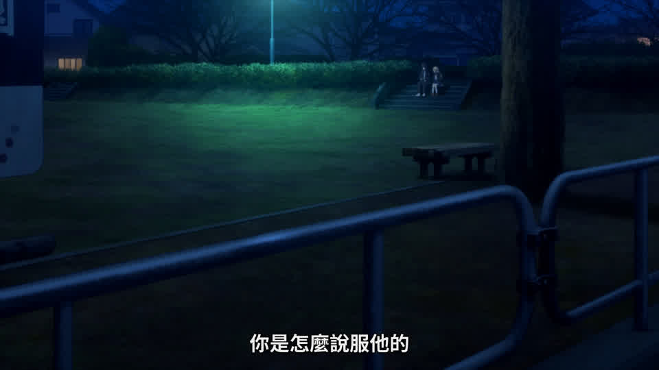
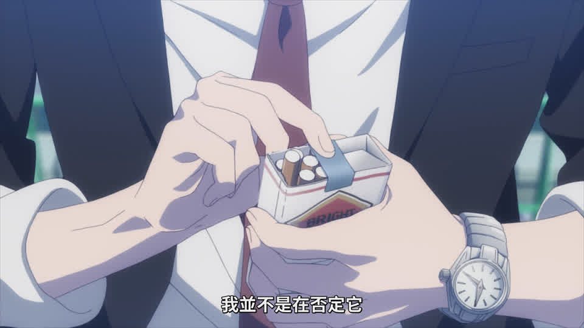
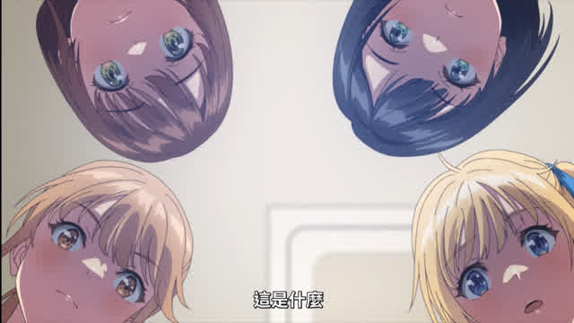
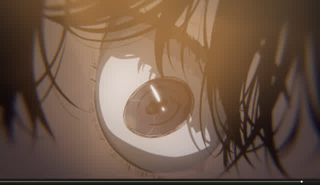
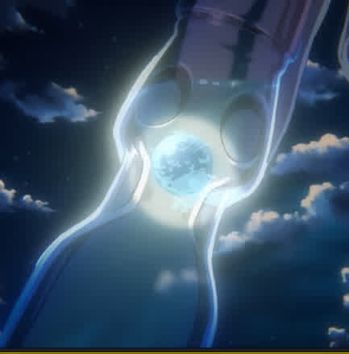
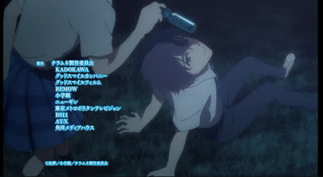

# 摘要

**主要观点：**
- 对动画《**波子汽水瓶中的千岁同学**》第二集的制作质量进行了讨论
- 认为第二集相比第一集在演出上有所改善，但整体仍偏向"聊天流"风格，缺乏突出的分镜设计
- 指出OP和ED的制作水平较高，但正片内容较为平淡
- 对角色建模相似度、部分配音表现（如羊宫妃那、石见舞菜香）和场景细节（如玻璃碎片处理）提出了批评

**涉及作品：**
**《波子汽水瓶中的千岁同学》**

**主要结论：**
- 动画制作存在节省成本的迹象，部分细节处理不够精细
- 配音表现存在争议，部分角色配音被认为不够到位
- 对于作品结局，讨论者从不同角度表达了期望，包括后宫结局、百合结局等可能性，但认为标准青春恋爱作品通常会采用跳过时间直接写未来的结局方式

# 正文

### **泠天阁**: 10-15 00:46:57
在看千岁同学

接着排todo list了

开头这段说理即使相比原作已经删节了，但语速还是飙起来了

绷不住了

主要还是对话信息密度确实挺高

### **天生**: 10-15 00:49:34
这个op做的确实不错

但是这个开头

玻璃碎了这么一大块

地上却只有一点

可能是考虑到如果铺的过多

### **泠天阁**: 10-15 00:51:53
为了让千岁朔能够坐着跟健太聊

场景得这么设计（）

### **天生**: 10-15 00:52:05
动作要从一个小跳变成大跳

这房间这么大坐哪都行

### **泠天阁**: 10-15 00:52:36
神必

背景做出畸变效果了 但人物没有（）

### **天生**: 10-15 00:52:49
而且面对着这一块竟然一块玻璃没有

### **泠天阁**: 10-15 00:52:53
也是

### **天生**: 10-15 00:52:59
如果这是柯南

我要怀疑手法了

### **泠天阁**: 10-15 00:53:11
绷

### **天生**: 10-15 00:53:31
woc遥控灯

家里装修的还挺好

### **牧星**: 10-15 00:53:51
@名侦探祥子 提前用胶带贴在玻璃上再打碎

### **天生**: 10-15 00:56:26
可以把一块玻璃靠在已经打碎的门上

营造出一种门还是好的错觉

这样要想办法就是如何只开众人把玻璃藏起来

### **泠天阁**: 10-15 00:57:13
最有手法的一集

### **天生**: 10-15 00:57:54
不过健太天天窝在家里竟然能变胖

### **Dr.**: 10-15 00:57:54
@名侦探祥子 什么叫门碎了？

### **天生**: 10-15 00:58:20
这个手法就是先把玻璃窗打碎

然后靠一块玻璃在上面

### **泠天阁**: 10-15 00:58:55
这一段感觉千岁朔的CV有点没放开？

### **天生**: 10-15 00:59:06
他cv是谁

我还没注意

### **泠天阁**: 10-15 00:59:22
我也不认识（）

### **天生**: 10-15 01:00:00
我要是窝在家里一天只吃一两顿肯定胖不起来

### **牧星**: 10-15 01:00:10
坂田将吾

### **Dr.**: 10-15 01:00:45
@名侦探祥子 有可能狂炫零食

### **泠天阁**: 10-15 01:01:01
确实 狂炫高热量零食

### **天生**: 10-15 01:01:23
我不怎么炫零食

感觉吃零食很费劲

### **泠天阁**: 10-15 01:02:35
石见舞菜香配的有点，每个字都在用力咬的感觉

略有奇异感

### **天生**: 10-15 01:03:08
原来这个人是ba里的sensei

我说怎么一股味

### **泠天阁**: 10-15 01:04:16
草

### **天生**: 10-15 01:05:49

### **洛水天依**: 10-15 01:05:59
怎么没有泠酱手办

### **天生**: 10-15 01:06:05
雪乃，团子，老八

感觉有点少

看来是不怎么买手办的宅宅

### **泠天阁**: 10-15 01:06:50

这个数量原来算少吗（）

### **天生**: 10-15 01:07:28
对他的藏书来说算少的

### **牧星**: 10-15 01:08:21
手办好贵

### **天生**: 10-15 01:08:38
他这一书柜书要是正版也不便宜

### **泠天阁**: 10-15 01:10:13
感觉第二集病情有所好转啊

看完之后泠酱去社区观察一下

### **牧星**: 10-15 01:10:40
@做完茶话会的泠酱 社会派

### **泠天阁**: 10-15 01:10:55
我有预感风评会回升

### **相遇天使**: 10-15 01:12:47
@做完茶话会的泠酱 好转在哪

我看前半段生肉就已经绷不住了

### **泠天阁**: 10-15 01:13:04
只不过没了第一话那几个特别用力的氛围感镜头之后，泠酱看到18分钟为止都是纯清水演出

超级聊天流

### **天生**: 10-15 01:17:45
我感觉青海阳似乎是建模做得最有小说里感觉的角色

### **泠天阁**: 10-15 01:18:29
泠酱朋友反馈了一点

这个取香烟的动作，应该是拍击烟盒使其向下移动，而香烟因为惯性留在原地，所以相对滑出来

但是这里省钱给烟盒做成静帧了

所以看起来像是烟盒不动 香烟自己滑出来（）

### **天生**: 10-15 01:19:41

这个镜头看确实四个人的脸模貌似是差不多

### **泠天阁**: 10-15 01:20:10
乐

确实感觉脸型做的不算很区分

怎么整个一集动画，最有分镜演出设计的是OPED啊

绷不住了

总的来说，泠酱因为已经看过原作了，所以正片部分没啥意外的（）

### **天生**: 10-15 01:29:09

这ed的眼画的不错

看见声优表突然反应过来

我对这集羊宫妃那说话竟然没印象

赶集倒回去在听一下

### **泠天阁**: 10-15 01:31:26
对羊姐爱的不够深

泠酱和朋友听羊一席话能吃两大碗饭

### **天生**: 10-15 01:32:42
他这个弹珠到底是要沉下去还是能拿上来

这个人会是谁呢

羊噶另有其人

### **牧星**: 10-15 01:34:26
这是什么番

### **天生**: 10-15 01:34:51
波子汽水瓶中的千岁同学

不行，对比起来ygfn配得完全没有杀气

### **牧星**: 10-15 01:35:13
什么类型

### **天生**: 10-15 01:35:17
额

### **相遇天使**: 10-15 01:35:18
千岁这五个女的有四个半是我老婆

剩下半个是ygfn

### **天生**: 10-15 01:35:31
现充版本的春物

### **相遇天使**: 10-15 01:35:52
该烤羊了，配的什么jb

### **天生**: 10-15 01:36:06
那她一共也说不了两句话

差不多就行了

暂时还不是主要配角

### **泠天阁**: 10-15 01:36:24
很有后宫了

### **天生**: 10-15 01:36:48
我从情感的角度出发希望后宫结局

但是从理性的角度出发没法

所以来写if线吧

### **泠天阁**: 10-15 01:37:23
泠酱从期望的角度出发对结局无所谓（）

### **天生**: 10-15 01:37:25
galgame是对的

### **相遇天使**: 10-15 01:37:47
我从情感的角度出发希望后宫结局

从理性的角度，希望学校四个搞百合，我抱走明日风

### **天生**: 10-15 01:39:07
但是觉得做成后宫对不上角色的成长与经历

### **泠天阁**: 10-15 01:40:26
？很有理性了

你这家伙

### **天生**: 10-15 01:42:32
从幻想的角度出发我想成为明日风的职业导师引领她成为一名优秀的编辑

感觉青春恋爱的小说标准结局就是跳过一段时间直接写未来啊