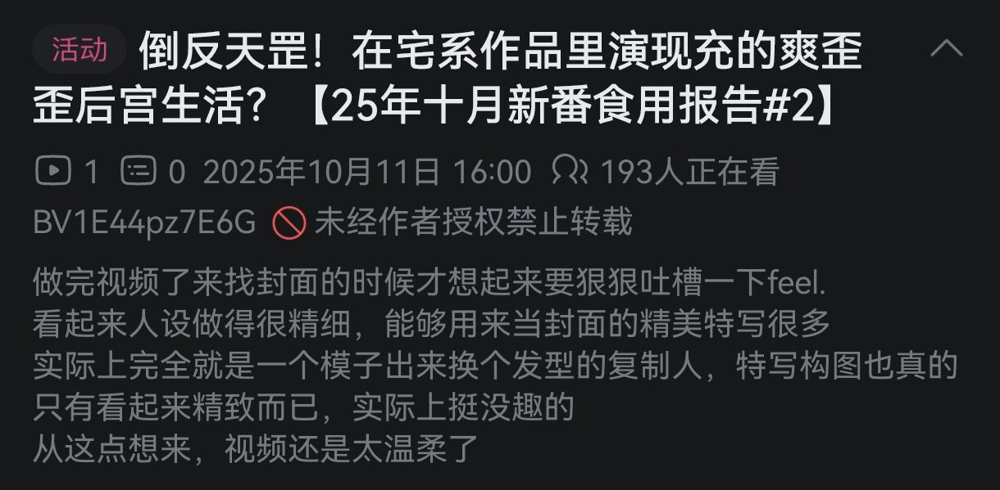

# 摘要

**讨论主题**：动画制作质量与创作者热情，特别针对“穷逼动画”（资源有限的作品）的讨论。

**主要观点**：
- **泠酱的立场**：
  - 批评动画中过度使用“呆板特写”镜头（如浅濑悠月的四连pose），认为这些镜头缺乏“能读的演出”（即镜头设计应有趣、可解读）。
  - 强调动画的尊严在于资源限制下创作者的“另辟蹊径”，即使造型崩坏，但镜头设计有趣的作品（如《义妹生活》）优于造型精细但呆板的特写。
  - 认为动画行业虽存在压榨和高离职率，但许多创作者（尤其是年轻人和资深人士）仍怀有热情，努力在作品中融入个人理念（如塞私货），这值得认可。
  - 指出穷逼动画中“齐心合力”的优质片段罕见，通常归因于特定环节（如分镜、演出、脚本）有想法且执行得当，而非整体团队协作。

- **天生的立场**：
  - 作为观众，更关注动画的视觉效果（如“脸画得好看就行”），对行业内部运作不了解。
  - 怀疑被压榨的创作者能否保持热情，认为现实中被压榨后难以换工作是常态。
  - 提出优质演出需要多要素（人物、环境、光影、音乐）协调，但认为穷逼动画中能看到半集不错已属难得。

**结论**：
- 双方认同穷逼动画整体质量有限，但泠酱主张应关注并褒扬其中创作者的积极努力和创意片段，而天生更侧重观众视角的实用性。
- 泠酱总结：在穷逼动画中，有意义的创作片段往往源于个别环节的“想法与执行”，而非团队统一协作，这反映了行业在限制下的挣扎与潜力。

# 正文

#### **泠天阁**: 10-11 16:06:46
刚刚看到鱼太视频

[QQ小程序]倒反天罡！在宅系作品里演现充的爽歪歪后宫生活？【25年十月新番食用报告#2】

动画第一集其他部分演出泠酱也老想吐槽了（）

这个近景正脸特写实在是堆的有点太多

特别是浅濑悠月那个四连pose的特写

泠酱要形容的话，大概就是淘宝店摆出的多张商品预览图（）

全是这种特写

#### **天生**: 10-11 16:14:29
我对这东西的看法是脸画的好看就行

#### **泠天阁**: 10-11 16:14:49
那你的要求确实得到满足了

这一块确实是泠酱的要求比较高（）

怎么说呢 因为泠酱喜欢反复细品动画 所以我需要“能读的演出”

所以像义妹生活一样造型崩坏但是能读的镜头设计，对泠酱要强于造型精细但呆板的特写镜头

如果造型又漂亮，镜头又有趣自然是最好了（）

总的来说我对鱼太这期视频的简介比较认同

#### **天生**: 10-11 16:18:01
能把模型做好的番就不错了

#### **泠天阁**: 10-11 16:18:38
泠酱觉得 穷逼动画的尊严就是由那些在严格的资源限制下另辟蹊径的创作者们维护的（）

#### **天生**: 10-11 16:19:02
穷逼动画本身就没什么尊严

流水线加工出来的东西

#### **泠天阁**: 10-11 16:19:29
错误的 这件事在当时手冢治虫创造出有限动画和对应的分工体系之后

#### **天生**: 10-11 16:19:54
我是看痞子说过业界压榨画师

#### **泠天阁**: 10-11 16:19:55
动画师们一边看不起有限动画，一边又想在有限动画里面做出花来避免自己被看不起

画师被压榨确实是行业现象，但尽管如此依然有许许多多的人将自己的理念融入作品中

就像泠酱经常转的，那位阿卡贝拉的演出家一样

从作品中读出他们的想法，认可他们的努力，这难道不是一件很符合道义的事情么（乐）

就像白箱用浪漫手法美化的那样

#### **天生**: 10-11 16:23:42
难说，被压榨的牛马还能怀有热爱是动漫里才有的情节

#### **泠天阁**: 10-11 16:24:04
错误的

热情被消磨完的牛马还留在动画行业才是作品里面的情节

#### **天生**: 10-11 16:24:39
难绷

现实要找工作

被压榨了没有工作可以换才是常态

#### **泠天阁**: 10-11 16:25:03
更多的是还有热情的年轻人和已经走出一条路的老人

#### **天生**: 10-11 16:25:16
不熟动画业界

#### **泠天阁**: 10-11 16:25:22
事实上动画行业的劝退率确实很高

#### **天生**: 10-11 16:25:27
以上全是猜测

#### **泠天阁**: 10-11 16:25:33
泠酱之前看过一些报道，一两年内的离职率特别高

这就是业界黑暗的真相（）

能干下去的 大多有点抱负 想要在动画里面表现一番（）

这也是为什么经常出现两种情况

一种是创作者往作品里面塞私货

另外一种是创作者遇到原创企划会加倍的塞私货（）

#### **天生**: 10-11 16:27:19
我对于动画行业其实不是很懂

我只是个观众

虽然一直想看白箱

但一直没补

#### **泠天阁**: 10-11 16:27:41
那么泠酱将我较多一些的认识分享给你

希望你能够对于动画的创作有更深的了解（）

许许多多剧情千篇一律，镜头死板无趣，作画僵硬粗糙，素材廉价重复，后期约等于没有的作品

泠酱确实也找不到动画制作上的优点能讲（）

但如果能找到 泠酱确实要加以褒扬

#### **天生**: 10-12 12:38:12
我突然想到

假如说动画的演出需要做好

那不止人物要画好

周边环境，光影和音乐都要做好

这应该不是一个人有热情能做好的吧

所以我们如果在穷比动画里看到了不错的创作

代表着起码有一群人合力，想法还统一

#### **泠天阁**: 10-12 15:07:00
怎么说呢 “全都做好了”在我印象里是几乎没有的情况

#### **天生**: 10-12 15:07:27
不是说全都做好

能有那么半集做好就不错了

#### **泠天阁**: 10-12 15:07:41
对于穷逼动画，常见的是“其中一部分至少及格了”，而“剩下某些部分有些意思”

即使对特定的片段，所有要素都做的漂亮也是很少见的

特别是最需要资源的原画这方面，如果制作组拉不到有实力的原画师，是很难有特别精彩的发挥的

之前我看泛式评价义妹生活EP9的时候就说

虽然这是我们最重要最好的集数了，但是这个明显花功夫的特写镜头画的还是有一点难绷

差不多就是这样的感觉（）

穷逼动画很少见到“齐心合力”的效果，或者说由于很多环节都是委托便宜公司搞的，中层领导（如监督、单集分镜和演出）甚至在阶段性成品交上来之前都不知道会做成什么样子（）

如果有时间而且本社正好有人才那还能修一修，否则只能交了拉倒 这才是穷逼动画（悲）

所以说，根据目前的经验，当我在穷逼动画看到了还算有意思的创作片段，通常会认为“是分镜/演出/脚本这里有点想法，并且下面正好执行好了”

能看到下层创作者明显卖力要做好的部分还是挺少见的（）

毕竟就如你说的，底层都是累死累活打工人

反例可以考虑义妹生活EP5，访谈里面说大伙确实特别喜欢第五集的重点人物，所以做的特别起劲

这里我觉得确实是有一些能看出各方面都不甘落后的片段
