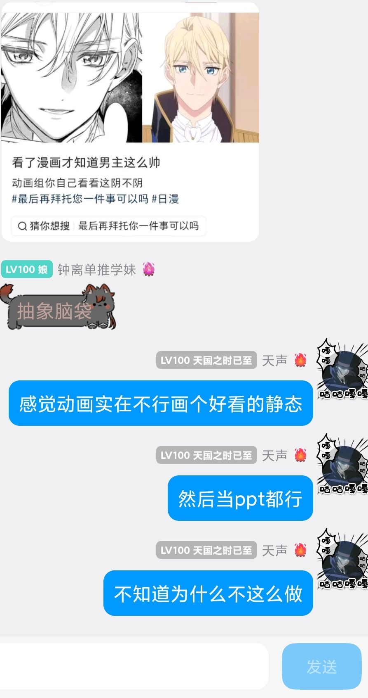
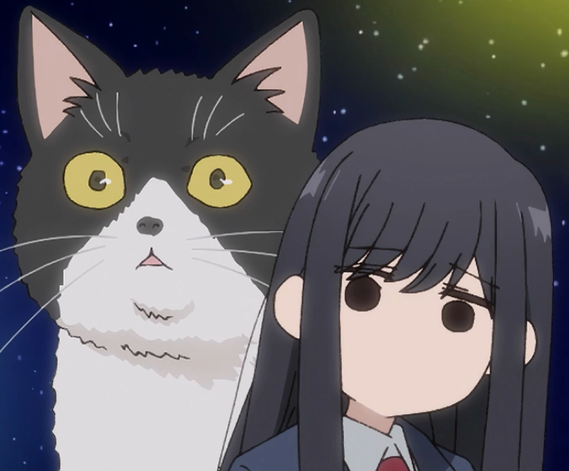

# 摘要

## 主要观点
- 动画制作中频繁出现画面崩坏的原因主要与外包模式和成本控制有关
- 便宜动画常采用多层外包模式，导致最终原画质量难以保证
- 制作质量受资金、人脉、工期和人员档期等多重因素影响
- 少数公司如京阿尼依靠本社人员体系能保持稳定的作画质量
- 动画公司的收益模式多样，有的只拿制作费，有的参与投资分红

## 结论
- 动画制作质量遵循"一分钱一分货"原则，但人脉关系能提升作品上限
- 高质量的动画制作需要天时人和，优秀的制作团队可遇不可求
- 完整的内部人员培养体系对保证动画质量至关重要

## 涉及作品
**一拳超人**

# 正文

### **天生**: 10-14 01:47:26
正态分布期望的左右偏差

看看这个

我原来看柯南的时候也好奇

为什么某一帧画得这么抽象

还要一直画

### **泠天阁**: 10-14 01:49:27
静态都崩确实...没得救了

### **天生**: 10-14 01:49:27
令人费解

### **泠天阁**: 10-14 01:49:54
为什么不“画一个好的静态”你问的好

### **天生**: 10-14 01:50:15
总不能一整个绘画组凑不出一双会画静态的手吧

### **泠天阁**: 10-14 01:50:28
实际上，即使我们分镜和演出已经尽量简化画面效果，尽可能堆静帧了

画面还是可能会爆炸

### **天生**: 10-14 01:50:33
那我只能理解为糊弄糊弄差不多就得了

### **泠天阁**: 10-14 01:50:44
因为便宜动画总是请外包的

然后你猜怎么着，外包公司又会外包给价格更低的劳动力

所以只要有几个不负责任的、糊弄的外包公司

那你就等着收垃圾原画吧（）

### **天生**: 10-14 01:51:53
唉

现在外包好像很多🇨🇳公司

### **泠天阁**: 10-14 01:53:19
中国公司也有不少外包水平还行的

韩国外包泠酱不太清楚，也有很多水平过得去的

东南亚外包就比较骇人了（）

### **天生**: 10-14 01:54:03
我觉得这个就是一分钱一分货

便宜是没好货的

### **泠天阁**: 10-14 01:54:23
也不完全，同时还得看人脉

### **天生**: 10-14 01:54:46
这应该也没有冲一百万送会员69折优惠吧

### **泠天阁**: 10-14 01:55:24
我记得有些片场有钱也抓不到能看的原画师（）

特别是在工期紧、出意外的情况（）

### **天生**: 10-14 01:55:42
好的原画师可能档期也忙

### **泠天阁**: 10-14 01:56:01
要是有老朋友的话开个友情价也帮你赶工两张不是（）

### **天生**: 10-14 01:56:17
人情这一块

### **泠天阁**: 10-14 01:56:39
当然 人脉这一块相比于下限更加提上限

只有少数如京阿尼这样，主力靠本社人员的公司，不太一样

京阿尼特有的作画质量稳定

### **天生**: 10-14 01:58:52
看过一拳一吗

### **泠天阁**: 10-14 01:58:59
已经没有印象了

但我知道 那是一个大佬云集的片场

### **天生**: 10-14 01:59:55
作画十分流畅

动作做的无可挑剔了感觉

### **泠天阁**: 10-14 02:00:15
好像甚至有主动来画的，和求人允许自己来画的（）

### **天生**: 10-14 02:00:24
所以啊所以

第一季做完之后

没有公司愿意接受了

### **泠天阁**: 10-14 02:00:51
这种片场可遇不可求，得天时人和都凑齐（）

### **天生**: 10-14 02:00:51
接手

### **泠天阁**: 10-14 02:01:09

### **天生**: 10-14 02:01:25
这导致第二季和第三季其实都是🇨🇳买ip才能做

为了给手游宣传的

造就了便宜动画

### **泠天阁**: 10-14 02:01:47
what can I say

至少我们享受了一季不是么

### **天生**: 10-14 02:02:09
唉英年早逝

我们动画也有自己的意难平

突然想到一个奇妙的类比

就是国家有完善的各行各业体系

轻重工业高端产业

### **泠天阁**: 10-14 02:04:22

### **天生**: 10-14 02:04:23
是否像是一个公司有完整的制作动画人员体系

先不聊国家

公司这么做可能得考虑培养时间和人力成本

### **泠天阁**: 10-14 02:06:14
运营策略这一块

### **天生**: 10-14 02:06:27
我感觉更可能卡在时间成本这块

我不是京蜜

但我多少是记得一点纵火案的时候

评论在说京阿尼培养这些优秀的原画师是多么珍贵

### **泠天阁**: 10-14 02:07:27
动画这种既有技术又劳动力密集的行业，确实培养时间和培养体系很重要

但是哪个因素最重要 泠酱确实不清楚

### **天生**: 10-14 02:09:13
动画公司参与分成吗

### **泠天阁**: 10-14 02:09:30
不同作品情况不同，具体看成立制作委员会时怎么谈的条件

有些情况是公司只拿一笔制作费，也有参与投资拿分红的