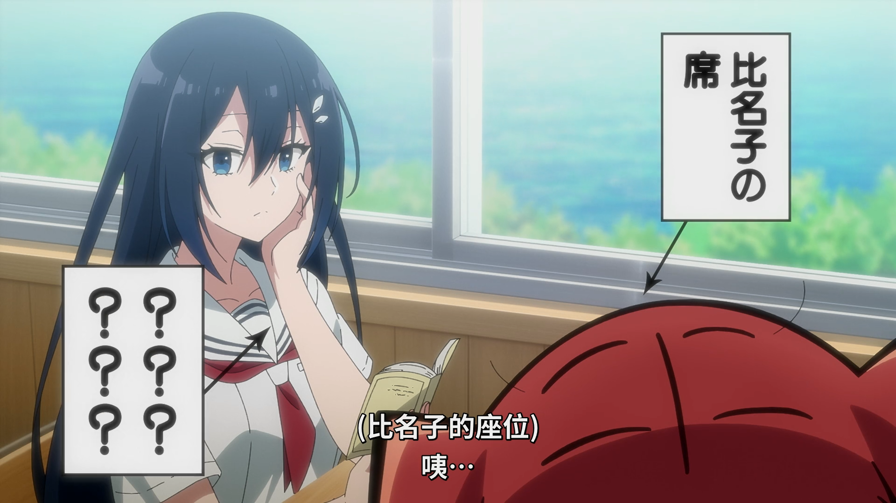

# 摘要

泠酱分析了动画中关于人鱼转学场景的演出设计，认为以下处理方式优于常见套路：

**优点：**
- 通过"坐请假同学位置"和"明天调位置"的设定，消除了空座位的都合感
- 同学们议论纷纷的背景音增添了校园生活的真实感
- 长椅场景中两人面面相觑不吃饭，配合广播通知的演出方式，虽然画面简陋但产生了意外幽默效果

**对比分析：**
- 相比《恋人不行》可能采用大量内心独白
- 相比一般动画可能采用紧张表情特写
- 当前简洁处理反而效果更好

**批评建议：**
- 指出6:03处镜头过于省钱（肩膀手动头不动）
- 认为座位标识用文字框虽有效果，但若能通过景别或角度在画面中自然呈现会更完善

# 正文

#### **泠天阁**: 10-09 23:33:36
来点真实感

人鱼转学过来的时候老师说班上一时没有你的位置了，你先坐请假的同学那里吧

然后明天正好大伙也来调一下位置

此时背景也配合着出现同学们议论纷纷的轻微声音

这就做的比一部分作品，在转学来人的时候直接插到后排靠窗主角位附近的做法要好得多（）

一方面来说能够消除“为什么这里正好有个空位”的都合感，另外一方面同学们的反应也增添了校园生活的社会感

#### **泠天阁**: 10-09 23:48:14
这个演出太搞笑了

两个人坐在长椅上面面相觑 也不吃饭（）

然后背景广播在发通知

虽然这个演出真的很穷 画面也没什么动态

反而让泠酱因为难绷而感到有点幽默

如果换成恋人不行的话，这里应该就是玲奈子内心独白一千条了

换成别的一般动画，大概是给个女主紧张的面部表情特写

这里的做法相比之下泠酱竟然觉得更好？

#### **泠天阁**: 10-10 00:03:49
这个镜头省钱的有点过分了（）

6:03处，大伙可以自行跳转

肩膀和手动 头不动的（）

#### **泠天阁**: 10-10 00:18:57
悲剧的空间处理能力之，连这是谁的位置也要特意标出来

泠酱觉得如果用一个大一点的景别或者调整一下角度就能把这个信息用画面表现出来了

虽说这里添加一个文字框确有戏剧效果

不过如果添加文字强调的同时，画面信息也有就更好了
