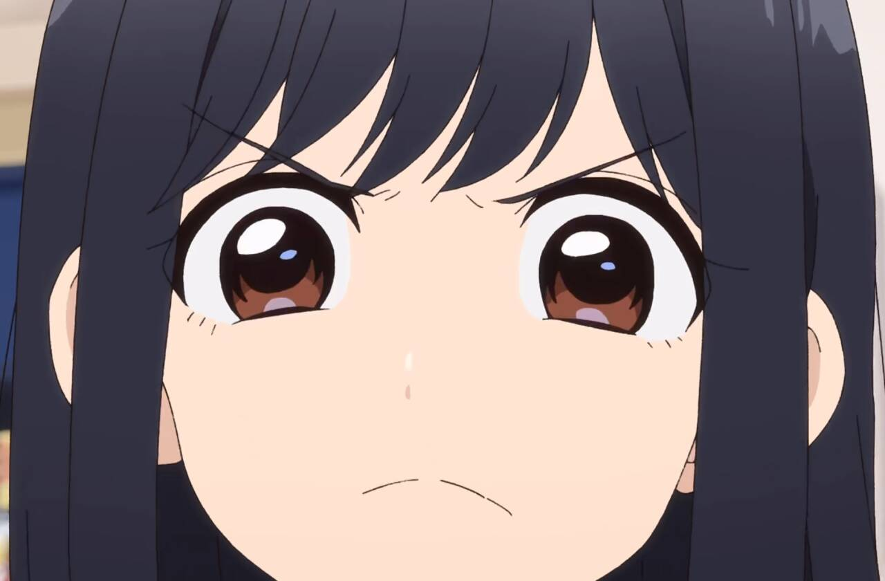

# 摘要

**主要观点：**
- 泠酱认为将名著与动画脚本、轻小说比较是"高射炮打蚊子"，但动画中也有名著级别的作品（如《横滨购物纪行》）。
- 泠酱提出"名著需通过比较和时间过滤才能被认可"，并主张新作与经典作品的对比有助于重新诠释名著的价值。
- Volycioe质疑新番动画缺乏与经典对比的实质价值，认为对"杂鱼新番"的默认期望本就较低，无需过度论证。

**结论：**
双方最终达成一致：通过新作与经典名著的对比，可以深化对名著价值的理解，尽管新作本身可能水平有限。

# 正文

#### **泠天阁**: 10-12 01:08:43
泠酱来了

如果泠酱用名著和动画脚本、轻小说比是高射炮打蚊子

为什么漫改动画和漫改动画比也是

#### **Volycioe**: 10-12 01:10:35
因为动画里也有名著

而横滨购物纪行我觉得算是

#### **泠天阁**: 10-12 01:10:57
那么我认为

同一个类别下的名著是比出来的

#### **Volycioe**: 10-12 01:11:27
所谓不可同日而语

#### **泠天阁**: 10-12 01:11:35
如果不经过比较，不经过时间的过滤，我们不可能知道谁是名著对不对

#### **Volycioe**: 10-12 01:12:03
问题就在这里

至少你提到的另一部动画，我不知道有任何让它值得跟以前的经典对比的理由（

#### **泠天阁**: 10-12 01:13:36
那我认为

首先这集的场景同样发生在横须贺

其次，这集也强调一个人文关怀

我觉得二者确有相似性（）

#### **Volycioe**: 10-12 01:16:55
我其实想说，对一个每季度随机刷新的杂鱼新番来说我们对它的默认期望就是低的，所以如果是去论证它具有超出这种期望的水平那么是值得的，如果只是说它确实如我们期望的一样是一部随机出没的杂鱼新番，那就没什么论证的意义

#### **泠天阁**: 10-12 01:17:12

但我认为，名著的价值也是随时间推移而可以再诠释的

通过与新的杂鱼的对比，我们可以加深对名著之所以为名著的认识

#### **Volycioe**: 10-12 01:20:00
[发呆]

那也可以吧

#### **泠天阁**: 10-12 01:20:17
很好 那我们达成一致了

