# 摘要

泠酱对动画片段的分析主要围绕女主角比名子的心理状态和象征意象展开：

**主要观点：**
- 女主角比名子具有高度"非社会化"特征，厌恶象征社会活动的夏日意象
- 她对"眼瞳如深海"的怪人产生了强烈执念，将海洋意象与这个人紧密绑定
- 动画通过对比手法强调她与周围社会化人群的疏离感

**关键分析：**
1. 深海意象的三重作用：
   - 象征比名子对怪人的思念
   - 表现她与周围人联系的减弱（声音模糊化）
   - 暗示她自身的"非人"特质（与深海生物相似）

2. 社交场景分析：
   - 与好友美胡的互动中断会立即让她陷入孤独状态
   - 路人的社会化活动与她非社会化的空虚形成鲜明对比
   - 夏日回忆可能涉及家庭创伤，加深了她对社交的排斥

**结论：** 比名子因心理创伤而疏离社会，将对深海眼瞳怪人的执念作为情感寄托，动画通过海洋意象和社交场景的对比强化了这一人物设定。

# 正文

#### **泠天阁**: 10-04 00:04:30
泠酱是这样理解的

首先，女主在一个人上学的途中遇到了怪人

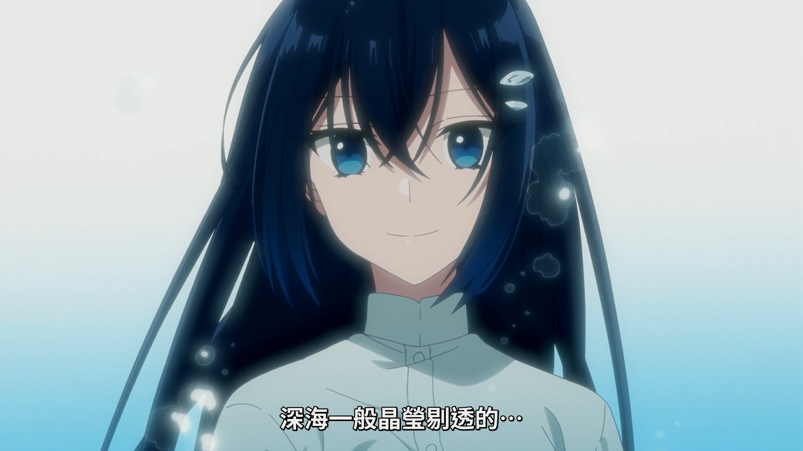她将其形容为，具有深海般的眼瞳

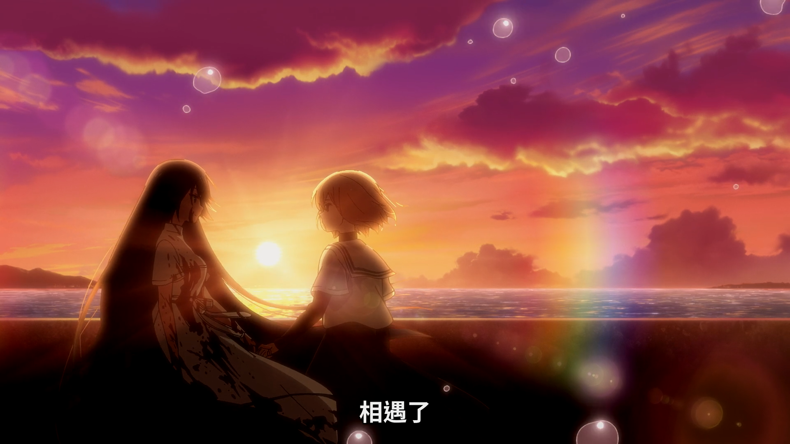在全集最开始的段落中，女主的独白是：“一闭上眼睛，就能听见海浪的声音，看见深海的颜色。被这个永无止境的夏日气味填满的空虚的日子里，我与眼瞳如深海的那个人相遇了”

因此，泠酱的理解是女主在相遇后已经将这个怪人与海的意象绑定了

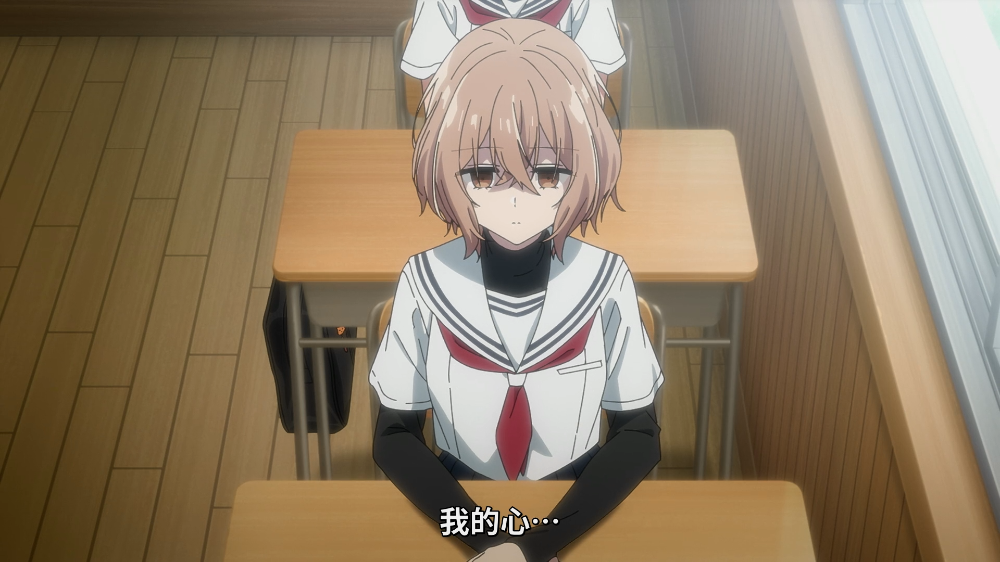“我的心，从那一天起就一直沉在海底的深处”

这一句话，泠酱认为首先的含义是她忘不了那个人

然后我们再从另外一个角度来看

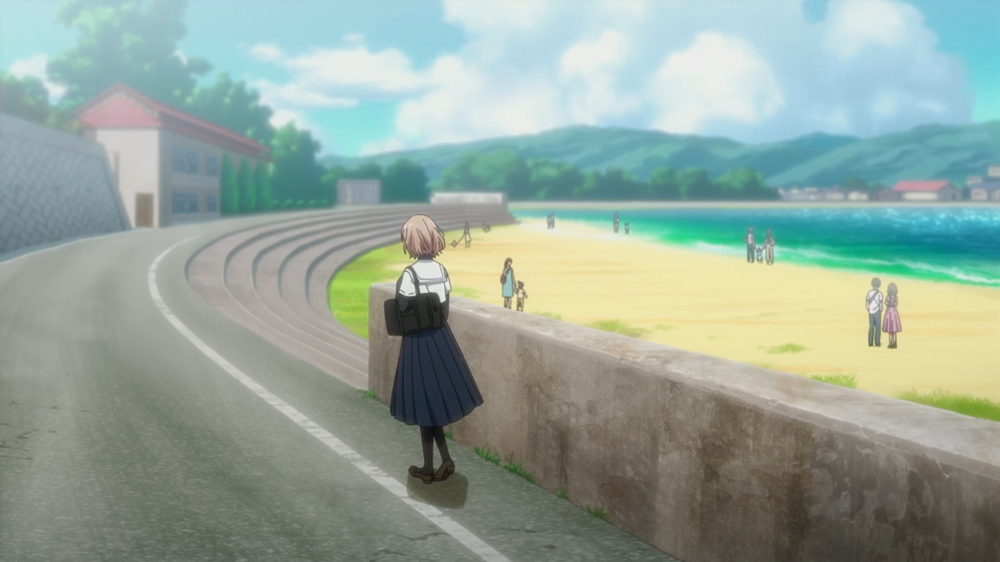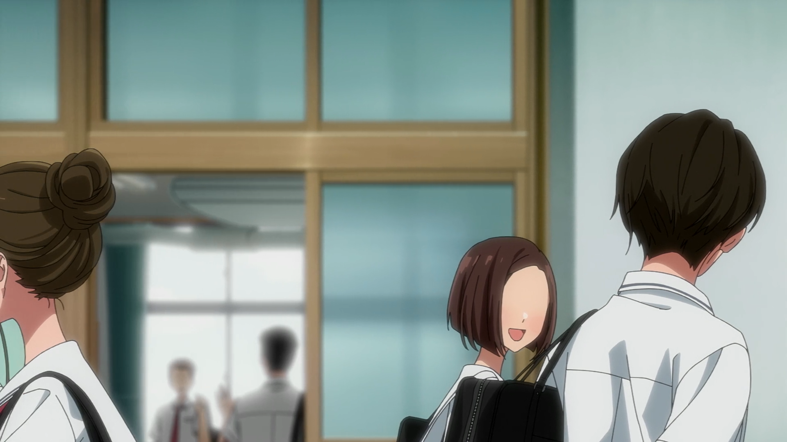从OP后，女主起床上学的这个片段开始，跳过中间与怪人相遇，再到她刚刚抵达学校

你会发现具有很明确的创作思路，就是强调路人的存在性

#### **泠天阁**: 10-04 00:14:43
在这里，路人几乎都在进行社会化的活动（或者说正在与他人交往）

而在这段中，女主再次抛出她对于夏天的看法

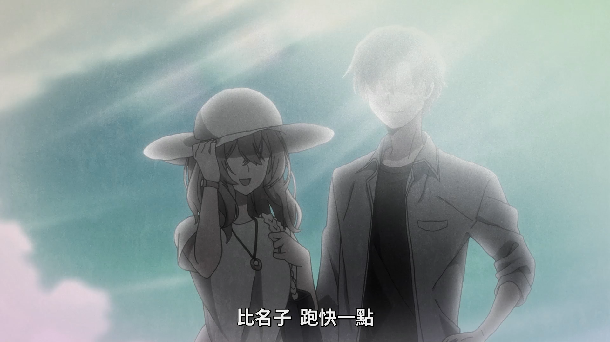夏天总是让她想到悲伤和难受的事情

考虑到回忆中是内容是一家四口夏日出游，泠酱认为她这次出游的经历很可能留下了阴影（例如就是直接导致了家人的去世）

在这里，夏日的意象与社会化的活动相绑定，而对此有心理阴影的女主则讨厌这种感觉，大量社会化的路人与非社会化的她形成明显的对比，强调出她的空虚

因此我们结合上面两点：1.女主对具有深海般眼瞳的人念念不忘 2.女主是高度非社会化的

就可以对于同学交谈这里得到一个较为清楚的理解

可以看到，本来女主比名子与目前唯一出场的好朋友美胡聊天时，美胡的侧脸是画出眼睛的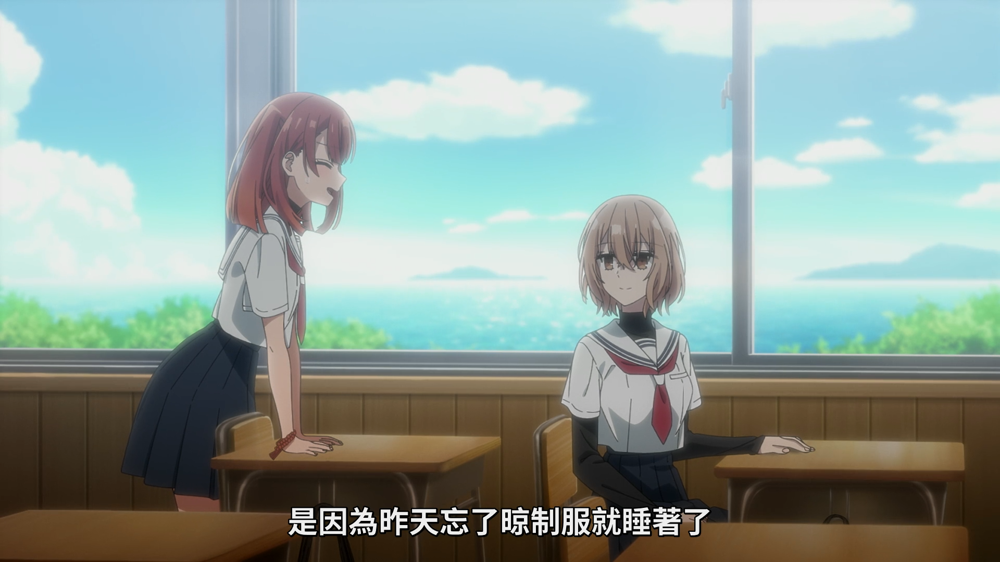

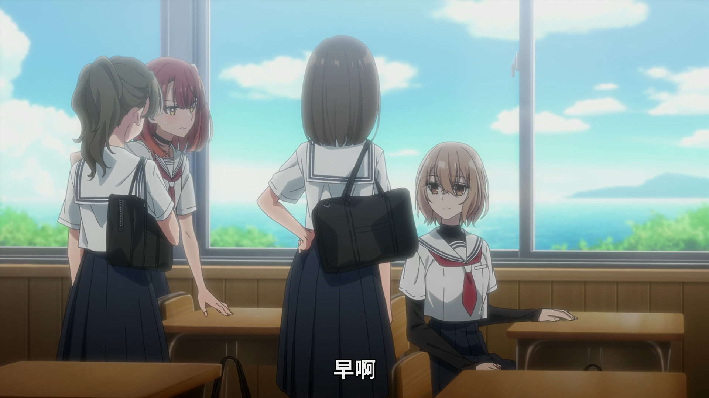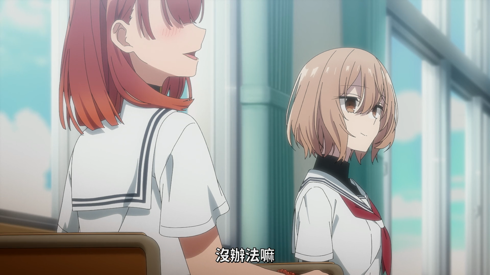而当另外两位路人同学插入对话时，美胡的面部描写方法就变了

美胡开始和二人对话，而比名子则变得沉默，或者说她由于朋友注意力的转移而暂时中断了与其的联系

一方面这反应出她不善交往的特点，而更直接的作用是让她快速的进入非社会化的、孤独的状态

因此她自然的开始一个人乱想，又想起来之前遇到的那个人了

#### **泠天阁**: 10-04 00:25:12
这个时候房间逐渐切换成深海场景，泠酱认为至少起到了三个作用

首先，同学们的声音被处理的模糊不清，也就是说思绪沉入海中的比名子与同学们的联系变得微弱了

其次，海洋的意象反映了她主观思考内容，也就是在想那个人的事，可以看到这里给了鲸鱼的眼睛一个特写，意思非常明确了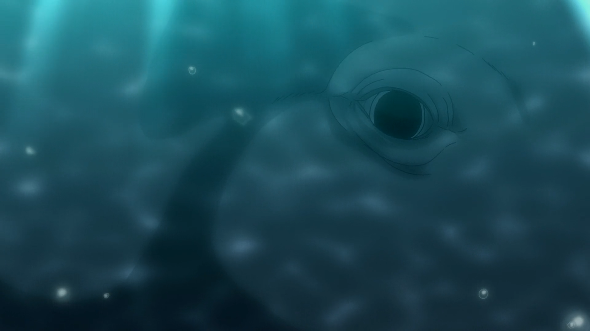

最后，女主被鱼类环绕的场景，我认为是在表达“其实比名子也和这些深海生物很像”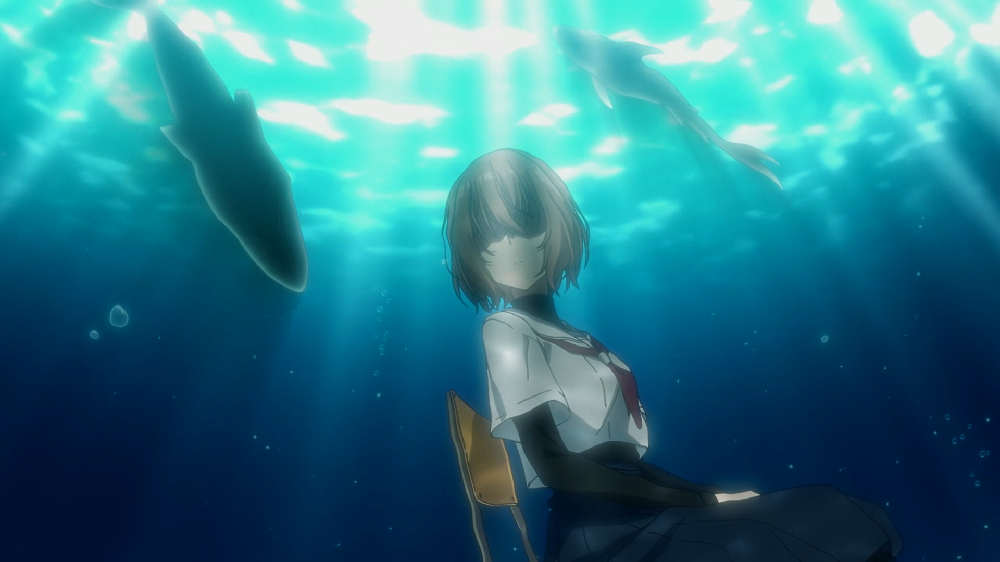

是在强调她也具有“非人”的特征

而在鞋柜前也是类似的

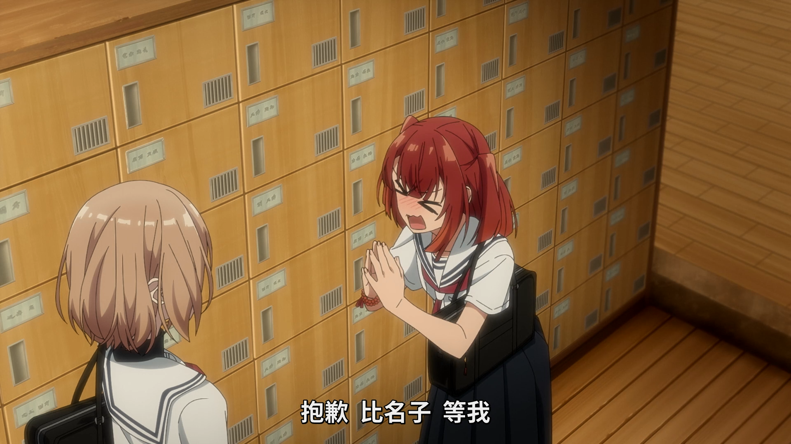美胡因为被老师找了，暂时没法陪比名子一起放学

失去与唯一朋友联系的她再一次回到了孤独的非社会化状态
