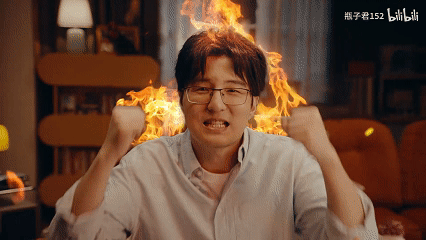

# 摘要

**主要观点：**
- 云上楼阁对《永远的黄昏》EP2给予极度负面评价，认为剧情充满恶意、三观尽毁，角色塑造令人不适。
- 批评男主过度圣母（被背叛后仍救人）、能力薄弱且行为矛盾，女主虽被形容为"机器人"但反而是最正常的角色。
- 作画和世界观问题可暂时容忍，但角色塑造（尤其是男主）引发强烈反感，甚至联想到其他作品（如JOJO、蜡笔小新）的负面形象。
- 其他参与者（天生、泠酱）部分认同评价，讨论男主行为可能隐含"渣男"逻辑（利用黄昏心理），但整体认为剧情质量低下。
- 云上楼阁最终破防，建议避免观看EP2，并自嘲理解观众对"现充男主"的普遍反感。

**结论：**
EP2被一致视为劣质剧情，男主圣母设定成核心争议点，引发观众强烈不适与调侃；作品被归类为"异世界厕纸"中质量较差的一档。

# 正文

#### **云上楼阁**: 10-11 01:06:05
永远的黄昏ep2:充满恶意，令人作呕，三观尽毁，全员神人的史诗级年度粪回（个人评）
现在只感到精神恍惚，仿佛大脑被银色战车搅碎了一样，作画问题可以原谅，
世界观的问题考虑到后续可能还有点说法，这些都可以先放到一边。
但这圣母男主真的令人生理不适，角色都非蠢即坏到令人发指，反派让人幻视JOJO以及蜡笔小新的某部剧场版（，不是刚被背刺转过头还要救人家，下集还得演怎么原谅人家是吧，怎么会有如此圣母之人！你搞一回我不说什么，一集之内连搞两回我就有点受不了了，哎哟我这男主是散兵吗，三度遭到背叛的勇者大人是吗，绝对是散兵吧。通篇下来男的是个圣母，啥本事没有叫得比谁都欢，一路下来纯躺除了扮圣母啥也不干，被人家卖了还得帮人家数钱。女主这个人机居然是最像人的，黄昏大人太伟大了真的，到集末一结算：男主得了mvp；女主没有人性，躺赢狗！女主这集的评分是3.0!！还说什么女主果然是机器人啊，女主是不是人难说，男主绝对是个臭**。
补充：ed好听，做得不赖。

#### **泠天阁**: 10-11 01:07:55
笑嘻了

#### **云上楼阁**: 10-11 01:09:14
我为先前的错误判断忏悔，同时对泠酱的专业眼光致以崇高的敬意

#### **天生**: 10-11 01:09:50
那我呢

 如何

#### **云上楼阁**: 10-11 01:10:17
这个版本才是对的

不行了真破大防了

#### **天生**: 10-11 01:11:36
我们的见解有颇多相似之处啊

其实我能给圣母男主洗一下

假如说他拿捏了黄昏的心理，笃定黄昏一定会来救他

这样就是渣男了

被偏爱的都有恃无恐~

#### **泠天阁**: 10-11 01:13:50
绷

#### **葵橋**: 10-11 01:14:18
刚看完黄昏ep1，感觉是异世界厕纸类剧情

#### **云上楼阁**: 10-11 01:14:35
不要看ep2

#### **泠天阁**: 10-11 01:15:08
 绷

#### **天生**: 10-11 01:15:19
虽然这么说不太好

#### **泠天阁**: 10-11 01:15:23
第二集就是第一集的再演

#### **天生**: 10-11 01:15:31
但厕纸之间亦有高低

#### **云上楼阁**: 10-11 01:15:43
我说真的，男主黑化当海王都比现在强

#### **天生**: 10-11 01:15:48
有的比较柔软

#### **云上楼阁**: 10-11 01:16:02
把三个机器人全攻略了

#### **天生**: 10-11 01:16:04
有的比较硌人

应该不止三个机器人

#### **泠天阁**: 10-11 01:19:52
确实

光看OP出现的就不止

#### **云上楼阁**: 10-11 01:22:52
睡不着了

现在血往头上涌

看会千岁同学缓一下

#### **天生**: 10-11 01:24:22
[偷笑]

#### **云上楼阁**: 10-11 01:24:58
现在有点理解bgm上的人看到现充男主的火气是从哪来的了