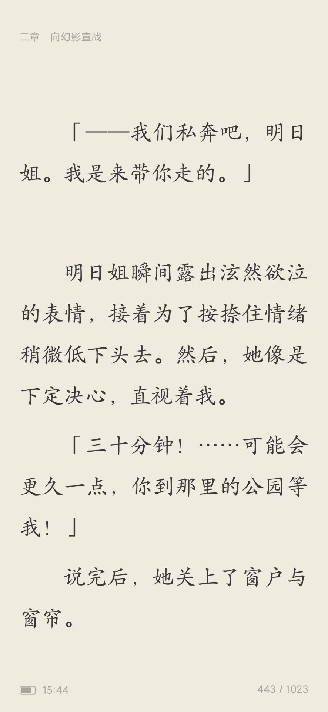

# 摘要

**主要观点：**
- 小说文本偏向哲学风格，包含大量哲理内容
- 明日风卷成功刻画了"恋人未满"男女关系的细腻互动
- 展现了灵魂伴侣(soulmate)式的深度情感连接

**核心内容：**
- 描写了两个角色之间大胆又羞涩的交往过程
- 强调灵魂层面的对话与交流
- 展现了相互呵护脆弱、肯定独特性、包容缺陷的亲密关系

**泠酱的评价：**
- 对作品给予高度肯定，认为"确实有点东西"
- 表达了对明日风卷的特别喜爱，甚至愿意删除其他卷只保留此卷

# 正文

### **天生**: 10-13 15:45:02
太有感觉了

或许这样的轻小说在文本上更偏向Philosophy，因为说德道理占的比重很大

### **天生**: 10-13 17:16:20
确实是有点东西的

### **天生**: 10-13 23:00:55
明日风这一卷把两个恋人未满的男女之间大胆但又羞涩的交往刻画的太好了

### **City.**: 10-13 23:01:31
这是一本独立单本

### **天生**: 10-13 23:01:41
完全的soulmate

### **City.**: 10-13 23:01:43
我要把所有其他卷全部删掉

### **天生**: 10-13 23:01:55
灵魂之间的对话

相互呵护着脆弱的一面

肯定对方的独特，包容着彼此的缺陷
