# 摘要

**主要讨论焦点：**
- 泠酱承认自己在讨论中习惯采用"高位视角"分析作品结构，但缺乏与其他视角的共融能力
- 双方就《千岁同学》与圣经的叙事结构类比展开争论：
  - 泠酱认为作品使用特定情节结构来传达"现充哲学"，类似圣经的传教结构
  - 天生认为这种类比过于符号化，忽视了文本主体和具体语境

**讨论方法论的差异：**
- 泠酱倾向于基于社区反馈和多平台数据分析得出结论
- 天生更注重个人直接阅读体验，认为社区观点并非必要参考

**达成的共识：**
- 跨视角讨论时应避免直接反驳，而应采取并行阐述的方式
- 语言表达需要注意避免天然带有的傲慢感
- 不同视角的解读可以共存，不必强求统一

**遗留分歧：**
- 对作品结构分析的有效性和适用范围存在根本分歧
- 对"受众"的定义和评价权标准未能达成一致
- 对轻小说的评价标准和关注重点存在差异

**结论：**
双方认识到各自方法论的根本差异，同意在保持各自视角的同时，需要注意讨论方式对社群氛围的影响。

# 正文

#### **泠天阁**: 10-09 22:19:49
说实在的，我认为自己试图站在高处的视角是对的，但是讨论时如何与其他视角实现共融我不知道怎么办

#### **天生**: 10-09 22:20:20
你有关注今年的诺贝尔奖吗

#### **泠天阁**: 10-09 22:20:28
例如千岁同学里面，我们应该都认可作者想要通过给千岁朔安排一些装逼情节来制造爽感对不对

文学社在聊，不过我光顾着写小作文了还没看

但是泠酱就会进一步的去考虑这种情节组织结构本身体现了什么，从而站在了相对高处

然后 泠酱经常出现一个现象

就是杵在高处不下来

#### **天生**: 10-09 22:23:06
我不是说文学奖

#### **泠天阁**: 10-09 22:23:31
虽然我在讨论的时候总是力图使用公正的语言，不攻击对方除了论点以外任何的部分，但是一直杵在高处确实带来了很大的敌意

那是哪个奖（）

泠酱对诺奖基本态度是等解析（）

#### **天生**: 10-09 22:24:39
那算了

#### **泠天阁**: 10-09 22:24:42
新闻出来议论纷纷的时候我不太看（）

#### **天生**: 10-09 22:24:43
不从诺奖入手

就是晶体的各向异性

我们也不用很哲学的语言来描述高位视角

#### **泠天阁**: 10-09 22:26:42
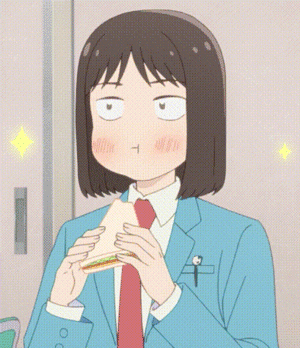

#### **天生**: 10-09 22:26:51
就是高处并不特别

#### **泠天阁**: 10-09 22:27:03
确实

#### **天生**: 10-09 22:27:20
我们称呼其为高处视角也只是人为的规定

它不是一个绝对值，而是确立参数的一个相对值

其实它并不比别的视角高等，也并不具有更高的数值

视角不同所以性质不同，那么人看作品接受到的情绪也并不同

#### **泠天阁**: 10-09 22:33:01
确实

#### **天生**: 10-09 22:34:50
也就是说大家读完之后针对其中的内容，可能会带来截然不同的体验，我会感到有趣，泠酱会鄙夷

#### **泠天阁**: 10-09 22:35:05
不完全正确

泠酱看的时候是同时包含了一般娱乐视角的

但是最后当我批评时，我会用高位视角的接受去覆盖

#### **天生**: 10-09 22:35:39
听我说完

#### **泠天阁**: 10-09 22:36:09

#### **天生**: 10-09 22:38:47
你用高位视角去批评的事情，很有可能是不被别的视角兼容的，那么当别人说出自己视角的感受时，你是大可以不要反驳的

#### **泠天阁**: 10-09 22:39:56
泠酱会需要承认，从某个特定视角来看，某段内容产生了这样的感受是合理的

#### **天生**: 10-09 22:39:57
这是自然而然分化出的两个方向，你反驳有什么用呢，这两个视角也不会统一，最好的结果也就是我懂了你是这么看的，你懂了我是这么看的

或许说从多角度批评作品会得到一个更加立体的解读

但是你不能把你的这个思想强加在别人身上，并不是所有人都愿意，有义务去配合你这个想法的

#### **泠天阁**: 10-09 22:42:29
那么你认为在昨天的讨论中，泠酱是否反驳了你对于作品的解读
我的看法是我们都在阐述各自的解读，同时在认为二者是不相容的

实则我们没有都没有认为对方的解读是错的，而是在用自己不同角度的解读试图覆盖

#### **天生**: 10-09 22:43:23
last and not least

就算是高位视角，你的发言逻辑也很诡异

#### **泠天阁**: 10-09 22:43:33
是这样么

相反的，泠酱认为我在不反对他人解读视角的情况下，提出新视角的解读是完全正当的

#### **天生**: 10-09 22:44:16
你不是反驳我的解读，你是别人说啥都要跟一个，不对，不是这样

不仅是我

#### **泠天阁**: 10-09 22:44:40
确实 所以我说昨天我也是在用自己的视角反驳你的解读

我确实在区分视角这一点做的有问题，昨天尤其的有问题（）

因为我当时认为我们的观点是相互矛盾的，所以我处处反驳 你是否接受这个解释

#### **天生**: 10-09 22:48:03
除非你认为十分不合理，否则慎用不是，语言天然就离思想有所隔离，你的否定更是为讨论埋下了不稳定因素

#### **泠天阁**: 10-09 22:48:24
确乎如此

我承认 我（没有们）的否定确有问题

#### **天生**: 10-09 22:50:28
或许说你没有反对，但是高位视角赋予你言语淡淡的傲慢

跨视角的反驳如同关公战秦琼

#### **泠天阁**: 10-09 22:51:05
这正是高位的，这里也就是道德视角本身固有的问题

#### **天生**: 10-09 22:51:23
如果反驳就不能跨视角

这是控制变量

#### **泠天阁**: 10-09 22:52:28
确实

#### **天生**: 10-09 22:52:57
跨视角只能是并行的关系，而不能刻意营造对立的氛围

#### **泠天阁**: 10-09 22:53:16
我认为我们双方这里都做错了 因为你没有从任何角度反对我将其与圣经的结构类比的做法

#### **天生**: 10-09 22:53:42
你这个类比好比苹果和草莓都是红的

所以苹果与草莓是一样的

#### **泠天阁**: 10-09 22:54:52
怎么说呢 我认为情节的组织结构肯定与情节达成的效果是强关联的

你认可这个观点吗

比如说，反复的拉扯，同时包含人物形象的反复倒退这样的结构，是与恋爱喜剧拉长进程的重要手段

#### **天生**: 10-09 22:56:13
强关联并不是一个准确的称呼

不构成一个命题

在高中就学过班上高的同学不构成一个集合

#### **泠天阁**: 10-09 22:56:50
这句话确实构成一个命题 但我懂你的意思

如果情节组织结构不能影响展现效果，我们就不需要研究所谓的“套路”，也没有人会使用“套路”了

#### **天生**: 10-09 22:57:47
你这句话的倒退换成摇摆可能更合适

#### **泠天阁**: 10-09 22:57:57
反复前进倒退，确实是摇摆的意思

正是因为有那么多好用的“套路”能够方便地达成作者想要的效果，这些情节组织结构的定式才会被千百年来的作者反复使用

不事么

比如说龙傲天的结构就是主角不断打倒装逼的反派

因此的，当我们注意到情节组织结构的相似性是，是不是也会考虑其目的的相似性

比如说看到典中典的展开就觉得这个会是厕纸了

#### **天生**: 10-09 23:00:45
你刻意的将结构符号化

却忽视文字的主体

#### **泠天阁**: 10-09 23:01:01
确实 结构是可以从一部作品中被抽象出来的

就像传统文学理论里面提到的，叙事的层级

#### **天生**: 10-09 23:01:20
好像结构代表了作品的一切

#### **泠天阁**: 10-09 23:01:37
当然 代表一切是不正确的

我们要看作者如何使用这个结构

#### **天生**: 10-09 23:02:17
除非超脱的足够新颖的结构，或者陈旧的过于老套

我是觉得结构并不具有你这样类比的代表性

#### **泠天阁**: 10-09 23:03:11
那么我们的观点具有决定性的分歧了

我认为一个结构可以正面地有意使用，无意识地选择，或者反面地使用

前面两者是可以被归入一类讨论效果的

例如，我认为圣经的作者使用这样的结构是为了颂扬神的伟大，以及批判先前犹太人反复判教的不忠；而千岁同学的作者使用这样的结构是为了凸显出千岁朔的装逼

#### **天生**: 10-09 23:04:24
我不认为圣经故事你说的是个结构

#### **泠天阁**: 10-09 23:04:28
二者都是正面使用的例子

#### **天生**: 10-09 23:04:47
这只是个顺序的故事叙述

#### **泠天阁**: 10-09 23:04:57
圣经中，犹太人反复叛教又回归是一个经典的叙事结构

或者说“套路”

并且在圣经旧约里面被重复了许多遍

那么我说龙傲天套路也是一个按顺序打败各路反派的故事叙述，你认为这构成一种情节的组织结构吗

#### **天生**: 10-09 23:06:26
这不叫结构

你知道结构是什么吗

#### **泠天阁**: 10-09 23:06:36
你认为是什么（）

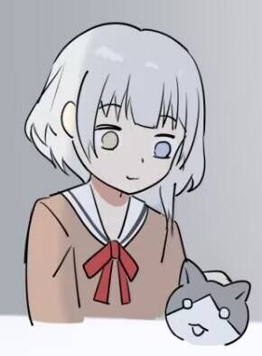是泠酱的理解不准确吗

#### **天生**: 10-09 23:06:53
从最基础的道理来说

顺序，插叙，倒叙

这是结构

线性叙事，非线性叙事，反线性叙事，这也是结构

#### **泠天阁**: 10-09 23:07:35
当然，叙事顺序是一种结构

#### **天生**: 10-09 23:08:36
或许可以去文学社讨论，我并不能保证我的解释一定正确

#### **泠天阁**: 10-09 23:08:50
我细想了一下 我使用的方法似乎确实有点骑墙

有点在“结构”这个词的边边上了

那我们重新换一个都能接受的词语形容

就是说这样一种，按照特定顺序排列起来的，特定的情节发展

反映了作者的写作目的

这个描述你能接受吗

首先这里是顺序的叙事，没有什么额外的技巧

我所提的一系列情节，即戒律前的困苦→神颁布戒律→信神→背弃神重归困苦→神再度降临拯救 按顺序组织起来

我指的就是这样一种定式

#### **天生**: 10-09 23:15:01
这种定式可能要更依赖于情节的程度

如果是一个男的拯救一个女的大概率是在讴歌爱情

#### **泠天阁**: 10-09 23:15:48
是的 这也取决于填进定式里面的角色是什么

#### **天生**: 10-09 23:15:52
一个男的拯救一个男的可能是称赞友情

#### **泠天阁**: 10-09 23:16:03
由于填进去的是千岁朔，讲的是现充哲学

#### **天生**: 10-09 23:16:16
一个男的拯救一群男的女的大抵就是传播教义了吧

#### **泠天阁**: 10-09 23:16:20
我认为这玩意可以和圣经类比，也就是耶和华与基督教

关键在于这作反复地讲现充哲学

我认为这和传教是非常类似的

圣经也是嘛，先知各种讲神让你们做什么，然后犹太人信着信着就不信了，然后出事（）

#### **天生**: 10-09 23:17:37
我觉得不像是现充哲学

首先该作的内容十分虚构

#### **泠天阁**: 10-09 23:18:33
我倒是觉得背景设定相当的写实化

不如说在轻小说里面算是很写实的了，既没有怪力乱神，又不是那种特别箱庭的作品（）

而且在谈论现充哲学的过程中，也反复强调了各种社会问题如偏见，而非一直讲浪漫主义的内容

#### **天生**: 10-09 23:20:03
那如果一个高中生说这简直就是我你觉得他是中二病犯了还是真有其事

日本可以和圣经类比的应该是奥姆真理教

#### **泠天阁**: 10-09 23:21:40
其实泠酱并不知道很多奥姆真理教的教义，我只知道它宣扬末世论

要类比我认为应该是这玩意的官方典籍和圣经类比，或是奥姆真理教与基督教类比

那么你认为宣扬神恩的诸位先知和使徒是癔症犯了还是确有其事（）

新约不好说，至少希伯来圣经都是后人写的

新约好像确有本人书信

#### **天生**: 10-09 23:23:56
方便管理和敛财啊

使徒的话

#### **泠天阁**: 10-09 23:25:02
也就是说，你认为圣经是明显在“告诉读者怎么做”，而千岁同学明显是“给读者看猴戏”

事么

#### **天生**: 10-09 23:25:28
你这个猴戏用的

#### **泠天阁**: 10-09 23:25:36
中二病嘛（）

这个词我刚刚随口选的（）

#### **天生**: 10-09 23:26:11
高中生犯中二病应该也算不上是猴戏

#### **泠天阁**: 10-09 23:26:28
我认为仅从文本的角度上来说，是无法区分二者的

之所以我们对二者有着明显不同的认识，是因为其他原因，例如我们知道圣经是宗教典籍，而千岁同学是轻小说

#### **天生**: 10-09 23:27:00
你不是高位视角吗

#### **泠天阁**: 10-09 23:27:05
宗教典籍是让人信教，轻小说是让人看个爽

#### **天生**: 10-09 23:27:13
这句话说的十分狭隘

#### **泠天阁**: 10-09 23:28:14
所以我认为，如果我们考虑到相关文化，那么二者的意图确实是有相当区分度的

确实

但是我认为文本层面的相似度，就足够我下判断了

不过我听说后续卷数也不怎么谈这套现充哲学了

快速回归后宫剧情了（）

#### **天生**: 10-09 23:31:02
我真在看第二卷

#### **泠天阁**: 10-09 23:31:03
真是有点难绷

#### **天生**: 10-09 23:31:05
正在

我是觉得这个不是现充

#### **泠天阁**: 10-09 23:31:29
对此我的看法是，作者在第一卷太想表达他的观点了（）

怎么说

#### **天生**: 10-09 23:40:07
作者或许想反对现充这个词，认为这个词的标签在社会中不是中性的，他的想法大概是每个人生来独特，没有贵贱之别，要走自己的路，没有好坏之分，但是社会现象表现出对一些亮眼人的攻击和一些不合群人的讦难，即便如此，也要坚定的做最好的自己

#### **泠天阁**: 10-09 23:41:23
整体来说我认可这个看法，但有些地方我存疑

例如在第一卷中，作者强调了千岁朔认为自己是现充，而山崎健太认为自己是阿宅，同时千岁朔认为阿宅和现充是非对立的

同时千岁朔破除了山崎健太种种对现充的偏见

由于全篇都围绕着现充与阿宅展开，我认为作者没有提出“世上还有除此之外的第三条路、第三种人”的观点

而这才是我支持的，我认为世上有许许多多的路，许许多多种人，它们都可以彼此混合

而非世上的人没有高低贵贱之别，但是有现充和阿宅，或者现充和非现充

#### **天生**: 10-09 23:50:52
我是觉得这是在对现充这个词剥去所有好的与坏的描述

仅仅是对于一种生活方式的称呼

#### **泠天阁**: 10-09 23:51:16
至少第一卷我认为没有

#### **天生**: 10-09 23:51:21
并不是浮于表面

#### **泠天阁**: 10-09 23:51:37
例如，“社交能力强”作为现充的一部分，本身在社会的语境下就是褒义的

我认为作者反对的是，将好坏直接贴在“现充”这个标签上

而实际应该先搞清楚现充是什么，然后再把好坏贴给现充具有的生活方式上

你觉得呢

#### **天生**: 10-09 23:53:52
我觉得似乎并没有贴好坏

#### **泠天阁**: 10-09 23:54:19
当然 作者是不支持贴好坏的

#### **天生**: 10-09 23:54:23
仅仅是在说一个长得帅，社交能力强的人，会成为这样

#### **泠天阁**: 10-09 23:54:27
确实

但是这些方面本身确乎是会被贴好坏的，不可避免

除非我们认为需要把“长得帅”再细分下去，例如评价一个人五官身材等方面

#### **天生**: 10-09 23:55:24
那我倾向于看作者说了什么

#### **泠天阁**: 10-09 23:55:31
否则我们终将需要停在某个层面，然后评价好坏的

#### **天生**: 10-09 23:55:37
先看字面意思再做揣测

#### **泠天阁**: 10-09 23:55:45
作者肯定是反对直接把好坏贴给“现充”

至于他支持停在哪里，这我确实不清楚

#### **天生**: 10-09 23:56:01
我觉得让私宅变成现充仅仅是他想报复

所以才教他

高中生有这些小心思还挺正常

#### **泠天阁**: 10-09 23:56:29
但是千岁朔这么说

#### **天生**: 10-09 23:56:53
如果有机会我们拿着实体书面对面讨论这些可能更合适

#### **泠天阁**: 10-09 23:57:09
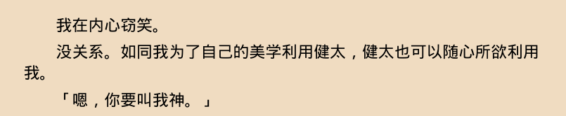

这就是健太请他指导这段

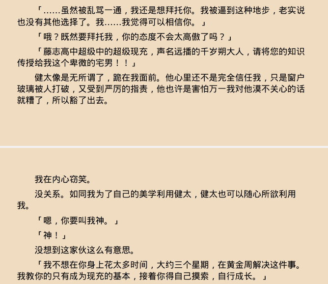完整版

很明显，他是为了实现自己的现充哲学而教健太成为现充的

#### **天生**: 10-09 23:58:27
如果真是也不是现充哲学

而是他的超人英雄哲学

#### **泠天阁**: 10-09 23:58:41
那么，他要求健太称呼自己为神，也和他认为自己应当远远超出其他人，到其他人够都够不到的地方，这个目标相符

#### **天生**: 10-09 23:58:54
额

刘神自称刘神是这样吗

#### **泠天阁**: 10-09 23:59:29
这好像不是（）

但这里我觉得要么解释为虚荣，要么解释为他认为这个称呼能够反映出“别人够不到”

实在不行，只能解释为千岁朔这个角色其实没这个想法，但是作者觉得这样写很cool（）

#### **天生**: 10-10 00:00:26
有没有可能

是千岁看了健太说的轻小说之后

中二病犯了

#### **泠天阁**: 10-10 00:00:53
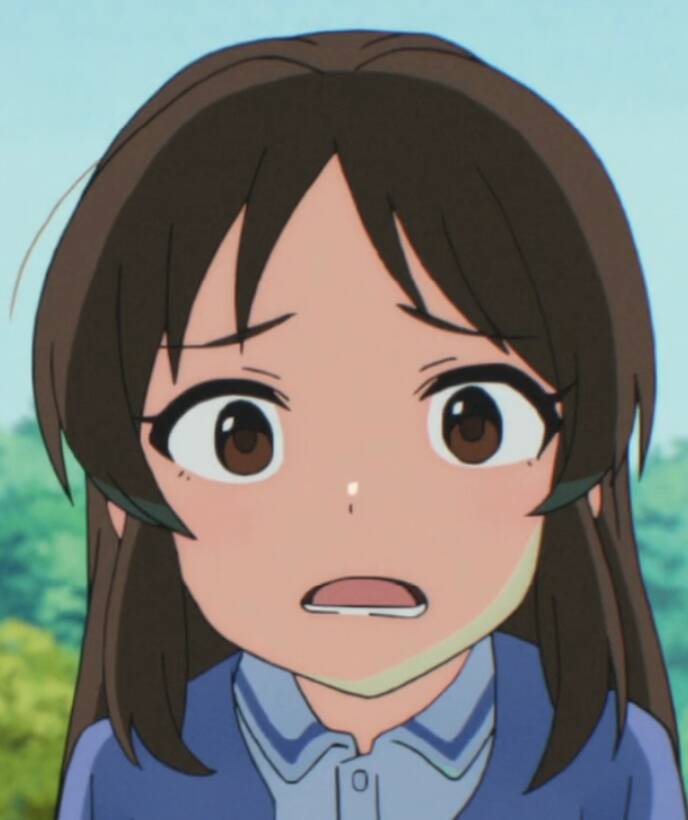

啊是这样吗

#### **天生**: 10-10 00:01:25
你不觉得这样解读很有趣味性吗，感觉像是挖到了作者的小巧思一样

#### **泠天阁**: 10-10 00:01:39
这样解读倒确实有理

但是泠酱认为我的解读也有理 二者不矛盾（）

又或者说

这两个解读合并到一起也不矛盾

#### **天生**: 10-10 00:02:49
差不多

#### **泠天阁**: 10-10 00:02:52
他读了轻小说之后觉得，自称为神很有意思，而且也符合自己的哲学

#### **天生**: 10-10 01:19:14
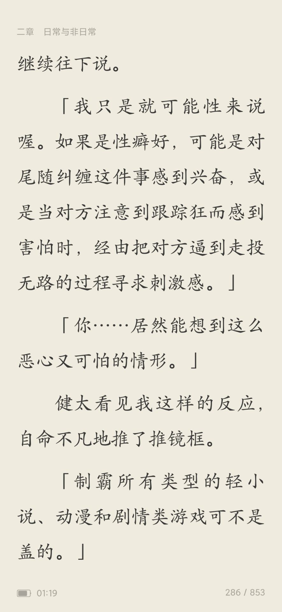

这哥们太有活了

#### **泠天阁**: 10-10 01:19:40
看来是被健太成功传教了

#### **天生**: 10-10 01:20:02
你说谁

#### **泠天阁**: 10-10 01:20:11
千岁朔啊（）

是吧

这里的说话者应该是千岁朔吧

#### **天生**: 10-10 01:20:36
虽然说我也能想到健太说的话

是的

#### **泠天阁**: 10-10 01:20:49
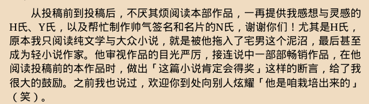考虑到作者在第一卷后记里面说自己被朋友传教的经历

#### **天生**: 10-10 01:20:51
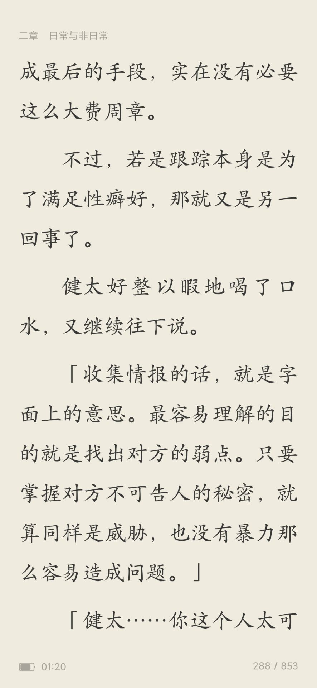

典中典

你也不想……

#### **泠天阁**: 10-10 01:21:00
我觉得这一段很可能是作者以自身感受为原本创作的

只不过健太的发言我觉得没什么新意

看起来会比较刻板的同时典（）

#### **天生**: 10-10 01:22:18
考虑到时间线

这一本发行的时候还没有很典

#### **泠天阁**: 10-10 01:22:43
这书19年第一卷吧 第二卷出版的时候应该已经比较典了

#### **天生**: 10-10 01:23:09
起码19年的我看到了不会觉得典

#### **泠天阁**: 10-10 01:23:12
不过如果是我在20年看到这书 那以泠酱的阅历成长速度 确实还没有很典

确实 毕竟我们还算...还算比较年轻的观众？

#### **天生**: 10-10 01:23:27
彼时典这个词还没有成为互联网时尚单品

#### **泠天阁**: 10-10 01:23:32
这还真是

当时看到肯定不会用“典”这个词

#### **泠天阁**: 10-10 13:19:59
我突然想到一个哲学命题

当你对泠酱说“不是受众”的时候

你是如何定义“受众”的

#### **天生**: 10-10 13:21:06
我们大可以用科学的语言来描述

泠酱的大脑里没有相应的受体

#### **泠天阁**: 10-10 13:21:50
从美学的角度呢

我物理上没有得到相应的感受，反映到美学上的表现是什么

#### **天生**: 10-10 13:22:52
你没有接受到其中的信息

#### **泠天阁**: 10-10 13:23:42
也就是，你认为“受众”是看得见作品中的美的信息的人

而“非受众”是看不见作品中美的信息的人

是这样么

#### **天生**: 10-10 13:25:06
这个说法含糊了一些

#### **泠天阁**: 10-10 13:25:19
你不妨提出自己更喜欢的定义

总之 泠酱问你下一个问题

你认为一个信息是“美的”或“不美的”是否仅由其自身特质决定

#### **泠天阁**: 10-10 13:35:49
如果是，那么世上确实存在形而下的、永恒不变的纯粹的美，如果不是，那么我认为接收到一个信息后，对其下两种判断都是合理的

这个例子可能不太恰当

我撤回了

当然 一个对象可以包含多种信息，其中可以有美的和不美的

如果我接受了一个对象传递的充分多信息，然后判断不美的部分更多，因此我认为这个对象是不美的，我是受众吗

#### **泠天阁**: 10-10 14:11:15
[聊天记录]

#### **天生**: 10-10 14:18:17
首先我一般不会提出定义，下定义是说明文才会使用而且也不经常使用的说明方法

#### **泠天阁**: 10-10 14:19:06
泠酱看了一些柏拉图对话录 这影响我认为要讨论清楚一件事，首先要搞明白我们在讨论什么（）

#### **天生**: 10-10 14:19:58
还有我貌似并没有指出信息在美学上的好坏，这个概念是泠酱唐突的引入而且在我看来对讨论是没什么作用的

#### **泠天阁**: 10-10 14:20:17
那么不引入这个概念也可以

泠酱的核心观点是：我们有理由在讨论的时候不展现自己接受的所有信息，因此对于某个特定的观众，我们没有能力判断他是否掌握了作品中特定的信息

#### **天生**: 10-10 14:22:53
最后是你对于接受信息说的好像是那么回事，但在群里说的确实完全没接收到信息，让人不免疑惑有给自己粉刷的嫌疑

#### **泠天阁**: 10-10 14:23:27
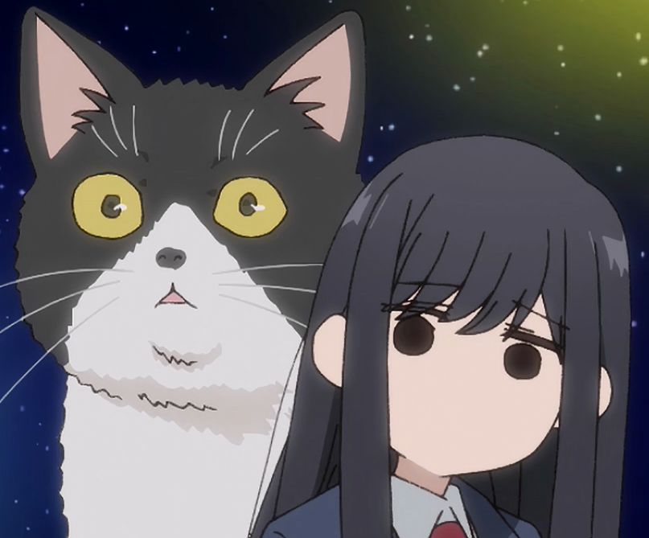例如 你认为在之前的讨论中，泠酱有哪些信息完全没有接收到 现在是嘴硬

如果确有 泠酱重估之后会承认我确有遗漏

#### **天生**: 10-10 14:30:27
[聊天记录]

#### **泠天阁**: 10-10 14:31:26
那么我承认，在原作中的这一段 我没有看懂把珠子和明月类比的功效

或者怎么说呢

#### **天生**: 10-10 14:31:46
就是你的思路是什么呢，我看过原作，我能懂一点，但是我懂得不多，动画这么拍我不懂，其他没看过原作的更不懂了

#### **泠天阁**: 10-10 14:31:51
我们已知千岁同学和珠子的意象强绑定，然后千岁同学希望成为明月

那么把珠子和明月关系到一起，我从创作思路上能理解 但美学感受上没有

我没有感受到这里写的哪里美（）

#### **天生**: 10-10 14:33:05
我要用沐猴而冠这个词了，虽然苏州应该是吴越地区

#### **泠天阁**: 10-10 14:33:14
我认为应该是，我看过了原作所以才能看懂动画这么拍的时候，意象之间的联系，但没看过原作的观众应该看不出来

但即使泠酱看懂了意象的联系，我也没有理解这样拍的美学在哪里

泠酱认为这样拍非常矫揉做作

当然 你完全可以质疑泠酱的鉴赏水平

#### **天生**: 10-10 14:35:16
不是鉴赏水平

是替莫须有的观众考虑的......姿态

#### **泠天阁**: 10-10 14:38:00
但是泠酱要说，我是根据bgm s1 nga 屑站 四个平台搜集而来的观众反馈，作出的观众反应概括的

泠酱并没有虚空圈出一个观众类型（）

至少在讨论热度最高的bgm 有大量观众认为本片的此类演出矫揉做作

泠酱探寻出一个很可能的原因，即由于缺乏原作中对于意象的解明，动画观众没看明白这是什么意思

#### **天生**: 10-10 14:40:26
我倒是认为是bgm比较矫揉做作

#### **泠天阁**: 10-10 14:41:23
我也承认，bgm上一部分长评比较矫揉做作，例如将千岁与自己看法中的现充对比

但是我认为，矫揉做作的评论，与认为本作矫揉做作的评论，是两类有一定区分度的观众

你怎么看

#### **天生**: 10-10 14:45:22
……

#### **泠天阁**: 10-10 14:45:46
同一个平台上的观众就要混为一谈吗 我觉得未必

至少在bgm 千岁同学的评分是反常双峰 这说明观众差异极大

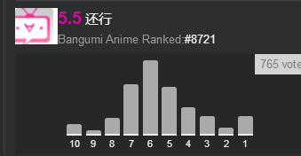

你可以看到10分和1分明显的异常

然后 此类言论当然不止bgm有，否则泠酱便会再单独分析平台差异

我去别的地方也给你搬一点回来

#### **天生**: 10-10 14:49:36
我不知道这个的重合度

#### **泠天阁**: 10-10 14:51:26
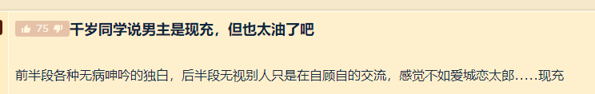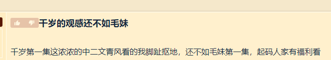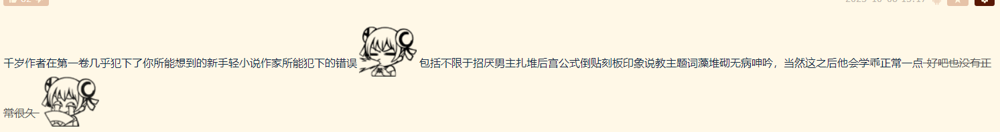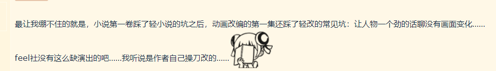

这是屎黄色论坛

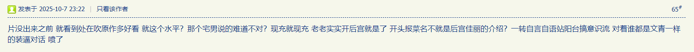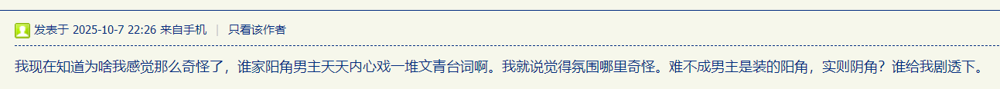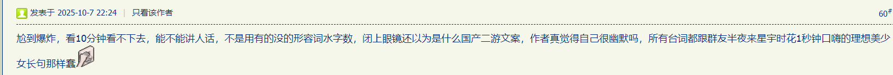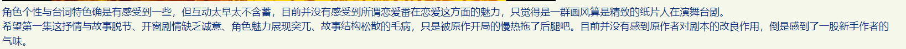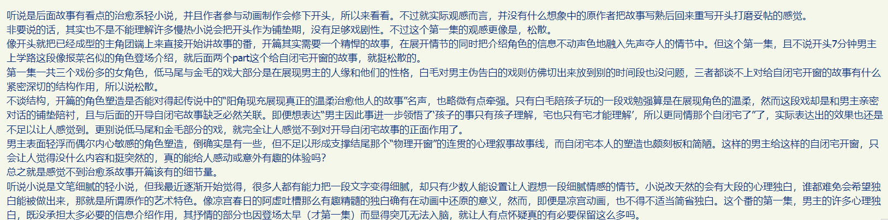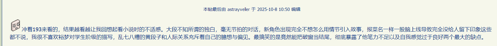

这是浅绿色论坛

有一说一啊我刚刚看了屑站两个播放量最高的相关视频的评论区

屑站观众确实基本只在意情节设计和人物互动尬不尬 很少有在意这个独白演出的

我必须承认这一点

泠酱对你的行为做一个有点恶意的揣测

由于你持自顾自看的方法论，而泠酱持边看边查的方法论

因此，你实则对于社区动态的了解是迟钝的

#### **泠天阁**: 10-10 15:01:28
因而当泠酱发表一些基于社区动态的观点时，你不知道泠酱在代表哪些观众

#### **天生**: 10-10 15:02:32
我好像并不需要太在意社区的观点

#### **泠天阁**: 10-10 15:03:07
那么我认为没有调查研究就没有发言权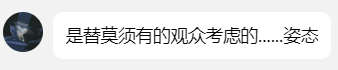

你没有立场认为泠酱代表的观众是莫须有的

#### **天生**: 10-10 15:04:35
那你去找找有没有人具体提出这两个意象的问题吧

#### **泠天阁**: 10-10 15:05:44
我记忆里确有 一会给你找一下

正在卫生间

等一下 你这个问题实则是陷阱

请看泠酱的具体表述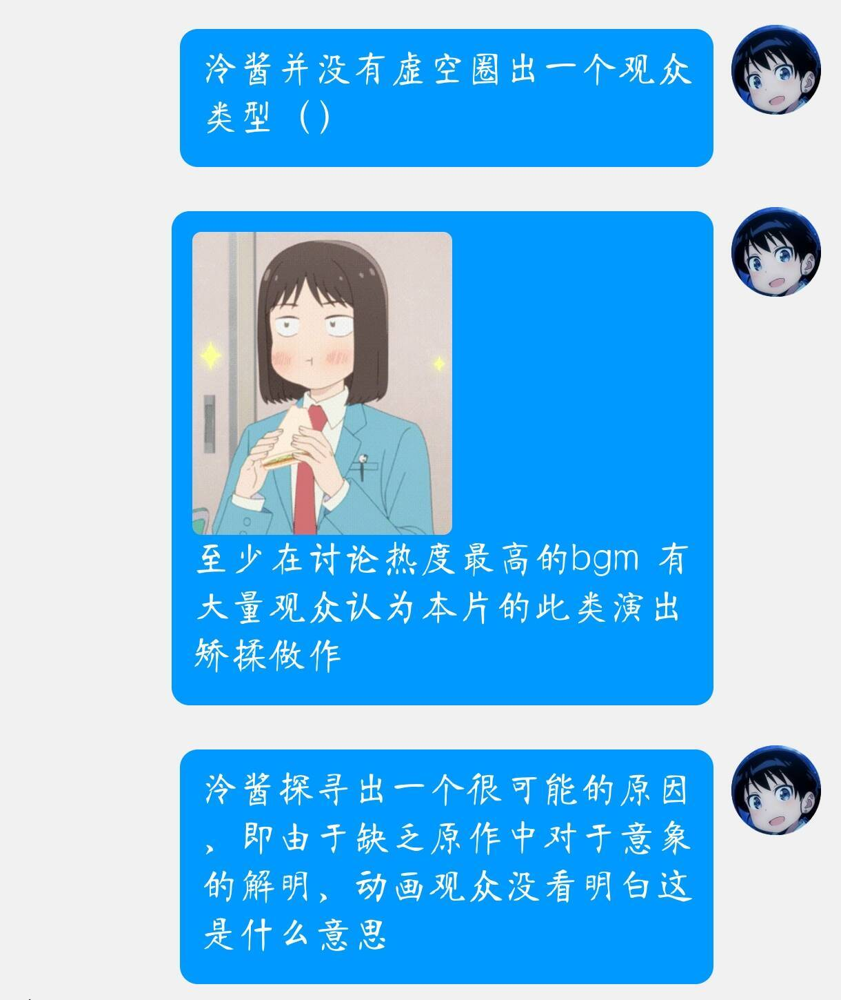

我观察到的现象是，在开头弹珠汽水瓶和中间月亮两处，许多观众反映矫揉做作

然后，观众没有看懂意象是我的推论，而不是现象

#### **天生**: 10-10 15:17:36
那你去找这些人聊吧

#### **泠天阁**: 10-10 15:17:50

看来这方面我们确实基于经验无法达成一致

但我觉得我们至少可以在信息接收与是不是受众这一块达成一致（）

#### **天生**: 10-10 16:09:21
对于泠酱关于信息接受与表达的理论，我不反对

#### **天生**: 10-10 16:50:36
但是泠酱是不是受众我自由定夺

#### **泠天阁**: 10-10 16:51:42
根据你给出的定义，在你不能确证泠酱没有接受到信息的部分，你不能论证泠酱不是受众

#### **天生**: 10-10 16:52:38
我不给出定义，不需要确证，也不需要论证

#### **泠天阁**: 10-10 16:52:46
ohno

既然你和泠酱持有根本不同的方法论，那么我们确实在这里不可能达成任何一致了

#### **天生**: 10-10 16:54:06
和只看过第一卷的泠酱没什么好说的[你真棒棒]

#### **泠天阁**: 10-10 16:54:54
这一块泠酱确有局限性

这是一个“看了多少，看的多仔细才有权评价”的问题

#### **天生**: 10-10 16:55:47
其实最主要也就是最简单的问题

#### **泠天阁**: 10-10 16:55:47
泠酱的观点是，轻小说是按卷写的，那么泠酱按卷评价是合理的

#### **天生**: 10-10 16:55:57
你看了之后会觉得矫揉造作

已经够了

#### **泠天阁**: 10-10 16:56:34

#### **天生**: 10-10 16:56:47
情节可以按卷评价

有些东西不行

#### **泠天阁**: 10-10 16:56:59
文笔行不行

#### **天生**: 10-10 16:57:06
这个可以

#### **泠天阁**: 10-10 16:57:12
我觉得文笔甚至可以按段评价

那么泠酱评价其矫揉做作我觉得非常合理

这个词我觉得最主要就是在反应泠酱对于作者文笔的看法，次要的是我对于作者安排这些独白情节的看法

#### **天生**: 10-10 16:58:05
 1

#### **泠天阁**: 10-10 16:58:16

#### **天生**: 10-10 16:59:02
那我们对轻小说的看法在很早就有分歧了

#### **泠天阁**: 10-10 16:59:25
各取所需这一块 确有很大的分歧

#### **天生**: 10-10 17:00:49
各取所需这个词....不怎么贴切

#### **泠天阁**: 10-10 17:01:14
你取所需，我取不到所需

#### **天生**: 10-10 17:03:57
从某种角度来说你多方面观看社区平台意见并做出批评也是在取所需

#### **泠天阁**: 10-10 17:04:24
确实

#### **天生**: 10-10 17:07:02
顺带一提我中午说的友好讨论不是指和泠酱

#### **泠天阁**: 10-10 17:07:10

#### **天生**: 10-10 17:08:20
虽然泠酱写小作文但我觉得泠酱没那么脆弱

#### **泠天阁**: 10-10 17:08:28
确实

泠酱实则敏感但忍受能力强

#### **天生**: 10-10 17:08:50
但群里的剩下642人就不一定了

#### **泠天阁**: 10-10 17:09:00
懂你意思

#### **天生**: 10-10 17:09:26
多发暴论不利于漫研群聊的讨论

#### **泠天阁**: 10-10 17:10:37
但是在照顾感情和宣扬理论之间 泠酱很多时候会选择后者（）

只是泠酱选择了前者的时候，这个行为是不外显的（）

泠酱实际持有的论点比发出来的还要多呢（）