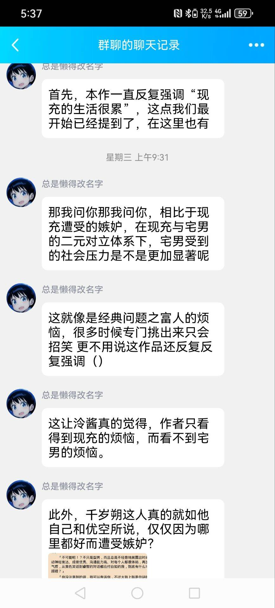
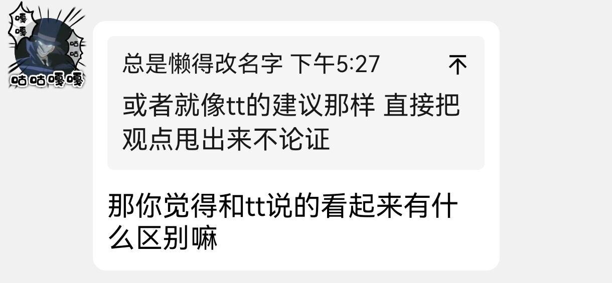

# 摘要

**主要讨论点：**

*   **泠酱的发言风格：**
    *   泠酱承认自己发言速度快，像“连射炮”，通常是因为已有成熟想法需要表达。
    *   如果发言卡壳，则说明他正在重新思考。

*   **观点输出的方式与权衡：**
    *   **问题：** 在群聊等公开场合，过快、过密的观点输出（“瀑布”）会影响信息传递效率。
    *   **理想模式：** 先给出最简洁的说明，然后根据质疑依次补充必要论据，以实现信息最少化。
    *   **泠酱的困境：** 他倾向于注重论证的“完备性”而非“简洁性”，因为简洁表达容易因逻辑环节缺失而遭受攻击；但过于完备的论证又会造成信息压力。
    *   **对比建议：** 有人（如tt）建议直接甩出观点不论证，但这与泠酱追求论证完整的期望不符。

*   **论据的可信度：**
    *   泠酱自认缺乏实地调研，主要依赖二手资料，但他会诉诸微观亲身经历者和宏观行业报告两方面的权威。
    *   天生对此持保留态度，认为“能信但不能全信”。

*   **关于特定作品批评的争论（以“千岁同学批判”为例）：**
    *   **泠酱的立场：** 他的批评基于其核心道德观点（例如：不应只强调富人/现充的困难，这对穷人/非现充不公平）。他论证了作品内容如何违背其道德观，但未论证其道德观本身为何正确。
    *   **泠酱的辩护：** 他引入“知识倒退”概念，认为任何论证都需要无法证明的“基石”，他选择将其部分道德观作为此基石。他强调“不论证”和“认为已论证到头”是不同的。
    *   **天生的反驳：**
        *   认为泠酱的批评与“知识倒退”无关，更像是“照本宣科”。
        *   指出泠酱的论证缺乏逻辑性，并认为群里很少人支持泠酱的观点是“自有道理的”。
        *   认为大众的不满主要在于泠酱“从道德出发的批评角度”，而非其具体论证过程的对错。

**核心结论/分歧：**

对话揭示了泠酱在表达和论证方式上的自我反思与外部反馈之间的张力。核心分歧在于：
1.  **论证的边界：** 论证应在何处停止？是否可以将个人道德观作为无需进一步论证的基石？
2.  **批评的视角：** 从个人道德出发批评文艺作品是否是一种有效或被广泛接受的方式？
3.  **表达的效率与严谨：** 如何在保证论证严谨（完备性）和提高沟通效率（简洁性）之间找到平衡。

# 正文

#### **泠天阁**: 10-11 17:13:15
最后我问你一个题外话啊（）

你会经常觉得泠酱发言速度特别快么（）

#### **天生**: 10-11 17:13:41
还好

我有时候也和机关枪一样

#### **泠天阁**: 10-11 17:14:07
那还行

泠酱连射炮的情况一般是想法早就有了，只是现在表达出来

#### **天生**: 10-11 17:14:33
我提一嘴针对上面那个业界画师的问题

#### **泠天阁**: 10-11 17:14:36
如果泠酱卡壳了 那么说明我正在重新思考（）

#### **天生**: 10-11 17:14:50
可能我们都缺乏实地调研的过程

#### **泠天阁**: 10-11 17:15:04
确实 泠酱掌握的仅限二手资料

但是我诉诸两方面的权威，微观的亲身经历者与宏观的行业报告

你认为值得信赖么

#### **天生**: 10-11 17:15:40
我不确定

#### **泠天阁**: 10-11 17:16:06

#### **天生**: 10-11 17:16:31
能信但不能全信的程度吧

但是观点的输出不能太快，特别是群里

#### **泠天阁**: 10-11 17:16:58
这确实是一个问题

所以泠酱在小作文里称之为“瀑布”

预先发表的观点 合并转发或许会好一些

但讨论过程中泠酱确实还没想好怎么做

#### **天生**: 10-11 17:17:51
私下里发能一条一条回

私下里火力覆盖就算了

人私下讨论个不知天地为何物正常

但去开会议做报告还是得简洁明了

虽然群里面也不是什么大会

但是人多了还是要追求信息传递的效率

#### **泠天阁**: 10-11 17:21:17
泠酱确实很多时候，相较于简洁性更注重完备性

因为有时我一简洁就开始遭受逻辑环节的攻击了 例如我引用原文的时候

简洁地引用就会遭致这样的质疑，即我是不是忽略了上下文

泠酱还记得，当你质疑我的观点，而我希望进行补充说明时，多次遭到你的鄙夷

所以说不预先构筑完整全面的论证也是有代价的（）

这个权衡问题泠酱暂时不知道怎么解决

我认为最理想的情况应该是我先给出最简洁的说明，然后根据质疑依次补充有必要的论据，以实现信息的最少化

#### **天生**: 10-11 17:25:27
你那合并转发的还能缺漏我是真没话说

#### **泠天阁**: 10-11 17:26:34
泠酱做茶话会的时候应该是对完备性要求最高的

所以动辄万把字（）

或者就像tt的建议那样 直接把观点甩出来不论证

#### **天生**: 10-11 17:27:25
这个最重要是你提出的东西即不简明又不代表

#### **泠天阁**: 10-11 17:27:28
这样确实减轻了信息压力 但与泠酱的期望不符

#### **天生**: 10-11 17:27:59
不你大多数情况都和这个看起来差不多

#### **泠天阁**: 10-11 17:28:08

#### **天生**: 10-11 17:28:49
你发的那个千岁同学批判大全

……

#### **泠天阁**: 10-11 17:30:08
我认为是这样的

我针对原作的那些批判，反映了我的道德观点

我论证了原作内容为什么不符合我的道德观点，但没有论证我的道德观点为什么是正确的

#### **天生**: 10-11 17:31:27
那你觉得和tt说的看起来有什么区别嘛

#### **泠天阁**: 10-11 17:32:14
这涉及到一个问题，称为知识倒退

详情参考下面的视频，我给出简单的描述

[QQ小程序]【WIRELESS PHILOSOPHY】知识论 - 知识倒退问题

根据主流的观点，我们需要一些无法证明的理念来支撑整座理念大厦

或者说，在这里，我将自身持有的一部分道德观点作为了论证的基石

或者说，我们的论证总需要一个基石，只是我这里选择了道德

#### **天生**: 10-11 17:36:41
我从头看你这个发言

和知识倒退没啥关系

#### **泠天阁**: 10-11 17:37:39
例如这里

#### **天生**: 10-11 17:37:49
可能是比较单纯的照本宣科

#### **泠天阁**: 10-11 17:38:22
我的道德观点是：不应该只反复强调富人/现充的困难，因为这对穷人/非现充不公平，不尊重

#### **天生**: 10-11 17:38:24
并没有看到其中的逻辑性，除了那个高等现充

说真的你如果觉得你那个发声的观众有其道理

#### **泠天阁**: 10-11 17:39:38
然后，我的论据是本作中千岁朔反复提及他的遭遇和困难，而山崎健太的看法都被定义为偏见

#### **天生**: 10-11 17:39:48
那群里几乎没人支持你也是自有道理的

#### **泠天阁**: 10-11 17:39:55
因此，我认为这部作品与我的道德观念相违背

确实

泠酱认为大多数人对泠酱从道德出发的批评角度不满

而不是认为泠酱的论证是错误的，或是进而认为泠酱的论证荒诞到无需证伪

泠酱这里回的是这一句

因为“不论证”和“认为已经论证到头了”是不同的

除非我们将自己对于一部作品的看法也认为是其他理念的基石，那么二者的结果是相同的

但这应该显然是不可取的
