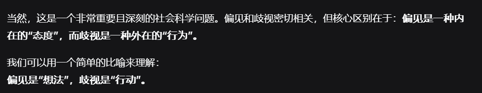

# 摘要

## 主要讨论作品
**《千岁同学》**

## 主要观点

### 关于轻小说与严肃文学的区别
- 轻小说基于文学叙述哲学，常通过主角说教推动情节，卖点是热血、青春等娱乐元素
- 严肃文学将哲学思想融入小说脉络，用精巧结构和优美文字包装
- 娱乐与严肃作品应视为光谱关系，难以泾渭分明

### 对《千岁同学》的评价
**角色塑造问题：**
- 千岁朔存在言行不一的问题：嘴上倡导"做自己"，实际行为不完全符合
- 被置于道德/社交高地指导他人，但自身开低俗玩笑（如"肉奴"情节），形成明显反差
- 表达方式被认为"装模作样"，引发观众负面评价

**情节争议：**
- "肉奴"等低俗玩笑引发道德质疑，特别是在三方关系中涉及对第三方开玩笑
- 山崎健太对现充的偏见是否构成歧视存在讨论分歧

### 道德评判标准
- 作品中出现道德缺陷角色是正常的，关键在于作者意图
- 道德评判存在"论迹"与"论心"的辩证关系
- 互联网环境容易放大对争议角色的负面评价

## 结论
双方认为对《千岁同学》第一卷的评价存在主观性差异，特别是在角色行为解读和道德评判标准上"见仁见智"，但承认作品在角色塑造和情节处理上确实存在争议性问题。

# 正文

### **泠天阁**: 10-13 23:55:41
虽然我很想给你转一个对原作第三卷的评价
但考虑到我没看后面，感觉转了也只能人云亦云

### **天生**: 10-13 23:55:54
你可以先发

我来替你品鉴

或者你发群里

### **泠天阁**: 10-13 23:56:48
https://bgm.tv/blog/362403

### **天生**: 10-13 23:58:43
不行

我第三卷还没看完

就差一点看到他说的这里

所以暂时不能评价

### **泠天阁**: 10-13 23:59:34
乐

这段结尾让泠酱有点联想到京吹了

### **天生**: 10-14 00:03:24
哪段结尾呢

### **泠天阁**: 10-14 00:03:38
就是最后说服老爹这个情节

### **天生**: 10-14 00:03:44
哦那个

最近我们是不是聊的越来越深入了呢

还是说经历了一次线下畅所欲言的鉴

### **泠天阁**: 10-14 00:04:26
我觉得应该是这书导致的（）

### **天生**: 10-14 00:04:33
不是

是每次一聊起来我都想出现在雁栖湖当面和泠酱聊一聊

### **泠天阁**: 10-14 00:05:09
真人快打说是

### **天生**: 10-14 00:07:44
我要说的一点是

轻小说和严肃文学在内容和目的上有根本性的不同

文学家是基于自己的一套的哲学而创作文学

轻小说是基于文学去叙述哲学

我下午不是说过轻小说在文本上更偏向于Ph嘛

就是很多轻小说啊，它总是让主角在各种场景说一套大道理

大部分都是主角说一大段好像很有道理的话然后解决了

所以轻小说的卖点是什么，热血，青春，奇幻等等，详见bgm排名分类表

这其实是和传统文学走的不是一条路

### **泠天阁**: 10-14 00:17:52
我觉得我们可以倾向于考虑，从我的角度来理解就是，以轻小说为代表的娱乐作品是借着各类情节中的道理进行“表演”

演的好了读者就满意了

### **天生**: 10-14 00:18:39
很多作家也是思想家，作家将自己的哲学思想融入小说的脉络中，用精巧的结构和优美的文字进行包装，而不显露其中的深沉

### **泠天阁**: 10-14 00:18:41
但是首先我认为，娱乐→严肃 也应该以光谱的形式看待

### **天生**: 10-14 00:19:05
上面那个表演的说法也不错

### **泠天阁**: 10-14 00:19:16
包括许多著名的戏剧作品，还有一些早期的报刊连载小说 都有通过道理表演讨好观众的意图

这里应该很难称得上泾渭分明

### **天生**: 10-14 00:20:18
我觉得特征比较明显

你可以说几部作品

### **泠天阁**: 10-14 00:20:37
因此我认为，我们还是要着手尽可能地量化考虑作品在“实际理念”和“演出效果”二者上做的怎么样

### **天生**: 10-14 00:20:39
我们具体分析

### **泠天阁**: 10-14 00:21:26
比如莎士比亚一些喜剧，泠酱不完全记得内容了，大致还有印象

比如《仲夏夜之梦》，里面精灵们发表的一些俏皮话

### **天生**: 10-14 00:22:41
俏皮的语言

### **泠天阁**: 10-14 00:23:20
再比如说柏拉图批评荷马在史诗里面将诸神描绘的太喜怒无常，确实很富有激情、吸引读者，但柏拉图认为这是和诸神该有的样子不同的

### **天生**: 10-14 00:24:18
描写诸神的史诗在当时可能和轻小说差不多吧

### **泠天阁**: 10-14 00:25:03
文体这一块确实不好说，泠酱文学史了解的不够深入

至少我觉得二者有一处应有区别

荷马史诗影响了后世无数或严肃或娱乐的作家，但泠酱认为轻小说在后世很难影响到偏严肃的作家

### **天生**: 10-14 00:27:08
这个是因为荷马史诗自有其开创性的思想

### **泠天阁**: 10-14 00:27:50

### **天生**: 10-14 00:27:55
还有一方面是荷马史诗相对真实的描绘当时的社会形态

### **泠天阁**: 10-14 00:28:24
就泠酱读过的一部分伊利亚特来说

实际跟超英大片差不多（）

### **天生**: 10-14 00:29:28
你觉得轻小说有什么先进性的理念嘛

### **泠天阁**: 10-14 00:29:38

### **天生**: 10-14 00:29:39
但是这个也不能这么说

### **泠天阁**: 10-14 00:29:56
任何时代的文体，至少都有其当代性的一面嘛

### **天生**: 10-14 00:30:06
因为现在的思想基本也都可以在历史中找到影子

轻小说就像是金鸡独立

一只脚还踩在现实

### **泠天阁**: 10-14 00:31:11
总的来说，我认为，由于作者的思想活动是不可观测的，通过作者的身份标签来评判其思想确有一定合理性，但不完全

### **天生**: 10-14 00:31:30
另一只脚不止伸向何处

没问题

### **泠天阁**: 10-14 00:31:43
因此泠酱即使是读轻小说，当作者说理时，我依旧要暂停一下考虑

这也是为什么第一卷读的我特别痛苦

千岁同学这书第一卷全是现充哲学（）

### **天生**: 10-14 00:32:11
还好吧

“苹果思维”

### **泠天阁**: 10-14 00:32:55
什么事苹果思维

### **天生**: 10-14 00:33:03
其实我也不知道

我只是玩个梗

不是很熟户晨风

我是简单理解成没钱的就是安卓思维，有钱的就是苹果思维

### **泠天阁**: 10-14 00:33:51
？

### **天生**: 10-14 00:34:35
现充哲学这个东西怎么说呢

在形式上有点类似贵族教育

### **泠天阁**: 10-14 00:35:45
现充哲学我觉得...我觉得细讲无益 不如搁置

因为根据泠酱自己的认识以及对评论的观察，不同观众对现充哲学的认识高度依赖身边统计学（）

而最接近这玩意的体系化理论是成功学（）

### **天生**: 10-14 00:37:01
我给你简化一下

### **泠天阁**: 10-14 00:37:13
我觉得还是回到第三卷的问题吧（）

### **天生**: 10-14 00:37:54
第一卷就是你想在社交中获得一个比较游刃有余的身份

该怎么做

我觉得就千岁的表达来说更倾向于不受太多束缚，比较坦然的做自己

### **泠天阁**: 10-14 00:39:01
我认为，千岁朔嘴上说出来的东西完全符合这个目的

### **天生**: 10-14 00:39:06
当然他是有点自夸的，他的意思是他本人很受欢迎

### **泠天阁**: 10-14 00:39:08
但是他做的事情不完全符合

### **天生**: 10-14 00:39:30
嘛这个主要是宅宅同学一开始的目的不太单纯

奔着复仇去的

我第三卷才看到三分之二的地方

### **泠天阁**: 10-14 00:40:49
遭受观众骂的最多的还是肉奴

### **天生**: 10-14 00:40:53
没办法和你聊说理的部分

### **泠天阁**: 10-14 00:41:25
泠酱也觉得，肉奴这段真挺有侮辱性的（）

### **天生**: 10-14 00:41:27
我只能说写对异性的憧憬写的还可以

我的评价是，新时代的小俏皮话

### **泠天阁**: 10-14 00:42:22
我承认是这样的 其作用是非常类似的

但是从程度上来说令人忍俊不禁（）

### **天生**: 10-14 00:42:46
我不否认

不过这确实也是时代的小特色了

### **泠天阁**: 10-14 00:43:09
而且精灵们的特质当然是爱恶作剧，这和千岁朔十项全能理性温柔的形象是不同的（）

这一段放色狼废人型男主，我估计大伙接受程度高多了（）

### **天生**: 10-14 00:44:41
依然会被骂的

自古文人相轻

### **泠天阁**: 10-14 00:45:29
我觉得“文人相轻”比较适合形容现充哲学这一块

而肉奴更偏向于一个公序良俗的道德问题

### **天生**: 10-14 00:47:41
放到公众平台说叫公序良俗

### **天生**: 10-14 01:12:58
开玩笑这种事

就是双方都不在意

就是玩笑

当然低俗玩笑不提倡

但专攻下三路也确实是一直以来的一个方向

### **泠天阁**: 10-14 01:14:11
我同意

但是在第一卷中，这里是一个三方关系

千岁朔对第三方开别人的玩笑

因此我们无从知晓被开玩笑的人在此时是否同意

### **天生**: 10-14 01:15:03
只能说

这就是长久以来的信任了

### **泠天阁**: 10-14 01:15:58
我认为这不可避免的会影响观众的判断，使得低俗桥段更接近恶劣桥段

类似的情节可以比如说无职转生里面的洛琪希胖次

### **天生**: 10-14 01:16:32
差不多吧

偏差这一块

### **泠天阁**: 10-14 01:16:49
还有一点就是，由于泠酱坚持不放弃道德的立场

### **天生**: 10-14 01:17:02
那要看你的道德放的有多高

### **泠天阁**: 10-14 01:17:04
所以我会质疑能够接受这样玩笑的人的道德水平

### **天生**: 10-14 01:17:33
比如说

飘

看过吗

### **泠天阁**: 10-14 01:17:43
没看过desuwa

### **天生**: 10-14 01:17:47
那算了

### **泠天阁**: 10-14 01:17:56
但泠酱确实承认 这是一个相对的问题

### **天生**: 10-14 01:17:59
不举例了，可能也不太恰当

就是我们一般很少看到神人模板的角色

圣人

打错了

### **泠天阁**: 10-14 01:18:55
草

这个打错含义完全变了（）

互联网导致的（）

### **天生**: 10-14 01:19:18
还真是

说起来神人从何出发源也不太可考

我完全同意把千岁爱开低俗玩笑当成一个缺点来批判

但我们是在看一部作品

而不是在选拔道德标兵

### **泠天阁**: 10-14 01:21:10
我知道 作品中出现道德败坏的人是很正常的

我们当然要考虑作者设立坏人的意图

### **天生**: 10-14 01:21:20
这是所有文学作品共同的

### **泠天阁**: 10-14 01:21:33
不能因为有坏人就认为是坏作品

但是泠酱认为，首先千岁朔在第一卷被作者放到了彻头彻尾的道德高地，他不断指点道德洼地的山崎健太

其次，他还不断的自视甚高，自认为道德水平很高

### **天生**: 10-14 01:22:56
怎么说呢

### **泠天阁**: 10-14 01:23:00
这就和他在某些方面的低俗形成特别明显的反差，不禁让人怀疑作者何意味

### **天生**: 10-14 01:23:09
不是道德高地和道德洼地

是社交高地和社交洼地

### **泠天阁**: 10-14 01:23:40
从“偏见”和“反对偏见”的角度来说

持有偏见的山崎健太在道德洼地

我认为这是合理的

### **天生**: 10-14 01:24:15
有趣的认为

偏见不是不道德

歧视可能才是

偏见只是认知水平

### **泠天阁**: 10-14 01:24:54
二者的语义确有微妙的不同，但我不能保证和你的理解一致

### **天生**: 10-14 01:25:22
偏见是认为苏北人很穷

歧视是觉得苏北人很穷，而且又笨素质又低

OK?

### **泠天阁**: 10-14 01:26:25
我很难与你在这个定义上达成一致

在我看来，你的定义着重强调的是恨屋及乌这一点

我暂且搁置你的定义，讨论你通过定义区分强调的内容

我认为，当千岁朔来敲门的时候，山崎健太对千岁朔爆发出的敌意符合这一点，例如假想他是来炫耀女朋友的

也就是说，由于山崎健太对千岁朔具有偏见，因此对他的更多方面加以贬低和污名化

### **天生**: 10-14 01:29:44
为什么会这么想呢

他只是一个暂且mygo的少年

### **泠天阁**: 10-14 01:30:08
D指导的看法是

### **天生**: 10-14 01:30:33
那按照d指导的思路

### **泠天阁**: 10-14 01:30:58
总的来说，泠酱认为山崎健太对现充确有偏见，并且面对千岁朔时，在言语上表现出了偏见，因此构成了歧视

### **天生**: 10-14 01:31:00
你觉得是论迹还是论心呢

### **泠天阁**: 10-14 01:31:54
道德这一块到底是论迹还是论心 确实是一个好问题（）

### **天生**: 10-14 01:32:04
看情况喽

### **泠天阁**: 10-14 01:32:07
柏拉图对话里里面就有这样的讨论

### **天生**: 10-14 01:32:22
百善孝为先，论心不论迹，论迹寒门无孝子

万恶淫为首，轮机不论心，论心世上无完人

我认为即使健太说了两句粗俗的话

### **泠天阁**: 10-14 01:33:43
至少泠酱站一个观点，就是在行迹上表现出歧视的人，必然是某种层面上不道德的

### **天生**: 10-14 01:34:50
不道德说轻可轻，说重可重

### **泠天阁**: 10-14 01:35:05
我认为，虽然健太确实在偏见和歧视这方面不道德

但是总体上来看，还是程度轻微

### **天生**: 10-14 01:35:29
嗯哼

### **泠天阁**: 10-14 01:35:45
之所以差别这么明显，主要还是因为千岁朔这个角色太过标榜自己和“现充”的道德高度

### **天生**: 10-14 01:36:18
我倒觉得千岁并没有太过标榜自己的道德水平十分高尚

### **泠天阁**: 10-14 01:36:36
在破除山崎健太“现充怎么这么坏”的偏见的同时，他发表的“现充都这么好”的言论形成了一种标榜

### **天生**: 10-14 01:37:56
我倾向于还是比较客观的阐述

### **泠天阁**: 10-14 01:38:39
那么即使泠酱退一步，千岁朔实际讲的内容没有这么的高高在上

但是他的表达方式影响了表达效果

此外，由于作品中还有许多被观众认为是“装模作样”的地方

千岁朔这个人物形象更加使人怀疑

使人往恶意的方向揣测

### **天生**: 10-14 01:41:12
我认为互联网太适合释放戾气了

### **泠天阁**: 10-14 01:42:11
当然，互联网的恶意倾向确实使得争议性人物更容易受到抹黑

但是我认为网络上许多对于千岁朔装腔作势的负面评价确实与本作的风格表现是吻合的

我认为第一卷确乎是有这么多问题的作品

### **天生**: 10-14 01:45:12
见仁见智了

对于角色行为的解读因人而异

特别是程度方面

这是个非常主观的判断

### **泠天阁**: 10-14 01:47:06
确实